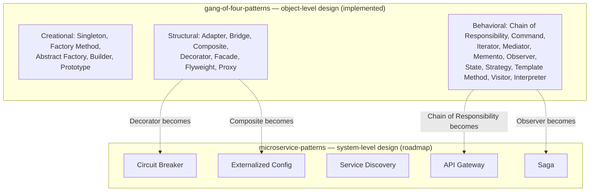

# Learning Design Patterns

## Table of contents

1. [Layout & modules](#learning-design-patterns)
2. [Why two categories of patterns](#why-two-categories-of-patterns)
3. [Getting started](#getting-started)
4. Module deep-dives: [gang-of-four-patterns](gang-of-four-patterns/README.md) · [microservice-patterns](microservice-patterns/README.md)

---

A Java / Spring Boot repository for studying software design patterns by implementing them, not just reading about them. It is organized as **two independent Maven projects** living side by side in one git repository (there is no aggregator/reactor `pom.xml` at the root — each module is built and run on its own):

```
learning-design-pattern/
├── gang-of-four-patterns/     Classic GoF patterns — Java 25, Spring Boot 4.1.0
└── microservice-patterns/     Distributed-systems patterns — Java 25, Spring Boot 4.1.0
```

| Module | What it is | Status |
|--------|-----------|--------|
| [`gang-of-four-patterns`](gang-of-four-patterns/README.md) | All **23 classic Gang of Four patterns** (creational, structural, behavioral), each with a runnable Java implementation, and a "Spring Boot in Practice" note showing where the same pattern is already at work inside the Spring/Spring Cloud stack | **Implemented** — see module README for the full reference |
| [`microservice-patterns`](microservice-patterns/README.md) | Intended home for distributed-systems patterns (circuit breaker, API gateway, service discovery, saga, externalized configuration) | **Scaffolding only** — a bare `@SpringBootApplication` with no pattern code yet; the module README documents the roadmap honestly rather than describing code that doesn't exist |

---

## Why two categories of patterns

Design patterns are usually taught as one flat list, but they solve problems at two different scales, which is why this repository keeps them in separate modules:

- **Gang of Four patterns** (`gang-of-four-patterns`) solve **object-level** design problems inside a single process: how objects are created, how they're composed into larger structures, and how they communicate. These are the patterns from the original 1994 *Design Patterns: Elements of Reusable Object-Oriented Software* book by Gamma, Helm, Johnson, and Vlissides.
- **Microservice patterns** (`microservice-patterns`) solve **system-level** design problems that only appear once a single application is split into multiple independently deployable services communicating over a network: how a caller finds a service instance, how a slow dependency is prevented from cascading into an outage, how a business transaction that spans several databases stays consistent.

A useful way to see the connection: several microservice patterns are literally a GoF pattern applied across a network boundary instead of within one JVM. For example, Chain of Responsibility inside one service (a servlet filter chain) becomes an API Gateway's filter pipeline across services; the Observer pattern inside one service (`ApplicationEventPublisher`/`@EventListener`) becomes a choreography-style Saga across services, mediated by a message broker instead of an in-process publisher. The `gang-of-four-patterns` README calls these connections out explicitly wherever the code demonstrates them.



---

## Getting started

Each module is a self-contained Spring Boot / Maven project with its own wrapper. From the module directory:

```bash
# Gang of Four patterns
cd gang-of-four-patterns
./mvnw test               # compile and run tests
./mvnw spring-boot:run     # run the Spring Boot application

# Microservice patterns (currently a skeleton — see module README)
cd microservice-patterns
./mvnw test
./mvnw spring-boot:run
```

For the full pattern-by-pattern reference — intent, problem statement, exact classes involved, key code, Mermaid diagrams, and demo output — see:

- **[`gang-of-four-patterns/README.md`](gang-of-four-patterns/README.md)** — all 23 GoF patterns, in depth
- **[`microservice-patterns/README.md`](microservice-patterns/README.md)** — current status and pattern roadmap for the microservices module
