# Gang of Four — Design Patterns in Java

- Implements all **23 classic GoF design patterns** organized into three categories
- Each pattern includes a real-world analogy, a working Java example, and a `demo()` method you can run
- Patterns actively used by Spring Boot / Spring Cloud are shown in a **Spring Boot in Practice** subsection with a dedicated `spring/` subpackage

**Base package:** `com.org.pattern.gangoffour`  
**Java version:** 25 | **Spring Boot:** 4.1.0

---

## GoF → Spring Boot / Spring Cloud Mapping

| GoF Pattern | Category | Spring / Spring Cloud usage |
|-------------|----------|-----------------------------|
| **Singleton** | Creational | Default `@Bean` / `@Component` scope in `ApplicationContext` |
| **Factory Method** | Creational | `BeanFactory`, `ApplicationContext`, `@Bean` factory methods, `@ConditionalOnXxx` |
| **Builder** | Creational | `UriComponentsBuilder`, `WebClient.Builder`, `RestClient.Builder`, `RestTemplateBuilder`, `SpringApplicationBuilder`, `AuthenticationManagerBuilder` |
| **Prototype** | Creational | `@Scope("prototype")` beans, `Provider<T>` injection |
| **Adapter** | Structural | `JdbcTemplate`, `MongoTemplate`, `RedisTemplate`, `KafkaTemplate`, `AmqpTemplate`, `RestTemplate` |
| **Composite** | Structural | `CompositePropertySource`, Spring Environment property hierarchy, Spring Cloud Config |
| **Decorator** | Structural | Resilience4j (`@CircuitBreaker`, `@Retry`, `@RateLimiter`, `@Bulkhead`), `java.io.*` streams |
| **Proxy** | Structural | Spring AOP — `@Transactional`, `@Async`, `@Cacheable`, `@Secured`, CGLIB / JDK dynamic proxies |
| **Chain of Responsibility** | Behavioral | Spring Security filter chain, Spring Cloud Gateway route filters, Servlet `Filter` chain |
| **Observer** | Behavioral | `ApplicationEvent`, `@EventListener`, `ApplicationListener`, Spring Cloud Bus |
| **State** | Behavioral | Spring State Machine (`spring-statemachine`) |
| **Strategy** | Behavioral | `@ConditionalOnProperty`, `@Profile`, injecting `List<Strategy>`, Spring Security auth providers |
| **Template Method** | Behavioral | `JdbcTemplate`, `RestTemplate`, `TransactionTemplate`, `JmsTemplate`, `MongoTemplate`, `RedisTemplate` |

---

## Table of Contents

- [Creational Patterns](#creational-patterns)
  - [Singleton](#1-singleton)
  - [Factory Method](#2-factory-method)
  - [Abstract Factory](#3-abstract-factory)
  - [Builder](#4-builder)
  - [Prototype](#5-prototype)
- [Structural Patterns](#structural-patterns)
  - [Adapter](#6-adapter)
  - [Bridge](#7-bridge)
  - [Composite](#8-composite)
  - [Decorator](#9-decorator)
  - [Facade](#10-facade)
  - [Flyweight](#11-flyweight)
  - [Proxy](#12-proxy)
- [Behavioral Patterns](#behavioral-patterns)
  - [Chain of Responsibility](#13-chain-of-responsibility)
  - [Command](#14-command)
  - [Iterator](#15-iterator)
  - [Mediator](#16-mediator)
  - [Memento](#17-memento)
  - [Observer](#18-observer)
  - [State](#19-state)
  - [Strategy](#20-strategy)
  - [Template Method](#21-template-method)
  - [Visitor](#22-visitor)
  - [Interpreter](#23-interpreter)

---

## Creational Patterns

- Deal with **object creation**, abstracting the instantiation process
- Make a system independent of how its objects are created, composed, and represented
- Five patterns covering the full spectrum from single-instance control to complex family-based creation

---

### 1. Singleton

**Intent:** Ensure a class has only one instance and provide a global access point to it.

**Analogy:** A shared database connection pool — there must be exactly one pool managing all connections.

**When to use:**
- Configuration managers
- Connection pools
- Logging services
- Thread pools

> **Spring note:** Spring IoC manages beans in singleton scope by default (`@Bean`, `@Component`). Understanding the four ways a singleton can be broken — and how to defend against each — is essential when implementing your own.

**Package:** `creational/singleton`

| File | Role |
|------|------|
| `DatabaseConnection.java` | Basic thread-safe singleton — double-checked locking + `volatile` |
| `ReflectionSafeSingleton.java` | Guard against Reflection attack |
| `ThreadSafeSingleton.java` | Double-checked locking + Initialization-on-Demand Holder |
| `SerializationSafeSingleton.java` | Guard against Serialization attack via `readResolve()` |
| `CloneSafeSingleton.java` | Guard against Cloning attack |
| `SingletonEnum.java` | Enum-based singleton — immune to all four attacks |

**Structure:**

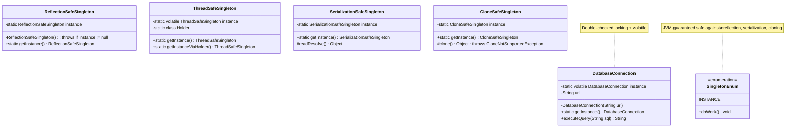
```mermaid
classDiagram
    class DatabaseConnection {
        -static volatile DatabaseConnection instance
        -String url
        -DatabaseConnection(String url)
        +static getInstance() DatabaseConnection
        +executeQuery(String sql) String
    }
    class ReflectionSafeSingleton {
        -static ReflectionSafeSingleton instance
        -ReflectionSafeSingleton() : throws if instance != null
        +static getInstance() ReflectionSafeSingleton
    }
    class ThreadSafeSingleton {
        -static volatile ThreadSafeSingleton instance
        +static getInstance() ThreadSafeSingleton
        +static getInstanceViaHolder() ThreadSafeSingleton
        -static class Holder
    }
    class SerializationSafeSingleton {
        -static SerializationSafeSingleton instance
        +static getInstance() SerializationSafeSingleton
        #readResolve() Object
    }
    class CloneSafeSingleton {
        -static CloneSafeSingleton instance
        +static getInstance() CloneSafeSingleton
        #clone() Object : throws CloneNotSupportedException
    }
    class SingletonEnum {
        <<enumeration>>
        INSTANCE
        +doWork() void
    }
    note for DatabaseConnection "Double-checked locking + volatile"
    note for SingletonEnum "JVM-guaranteed safe against\nreflection, serialization, cloning"
```

- All six variants share the same shape: a **private constructor**, a **static self-reference**, and a **static accessor** — they differ only in how they defend that accessor against reentry
- `SingletonEnum` needs no explicit guards because the JVM enforces all four properties as part of the enum contract

---

#### Core implementation — Double-Checked Locking

```java
private static volatile DatabaseConnection instance;

public static DatabaseConnection getInstance() {
    if (instance == null) {
        synchronized (DatabaseConnection.class) {
            if (instance == null) {
                instance = new DatabaseConnection("...");
            }
        }
    }
    return instance;
}
```

- `volatile` prevents the JIT/CPU from publishing the reference before the constructor completes
- The outer null-check avoids acquiring the lock on every call after the first initialization
- The inner null-check inside `synchronized` handles the race between threads that both passed the outer check

---

#### Singleton Hacks & How to Defend Against Them

- A naive singleton can be broken in four ways
- In production code you must guard against all four
- The Enum singleton handles all four by default — no explicit guards needed

---

##### Hack 1 — Reflection (`ReflectionSafeSingleton.java`)

**The attack:** `getDeclaredConstructors()[0].setAccessible(true)` bypasses the `private` modifier and calls the constructor a second time, creating a second instance.

```java
Constructor[] ctors = Singleton.class.getDeclaredConstructors();
ctors[0].setAccessible(true);
Singleton second = (Singleton) ctors[0].newInstance(); // breaks naive singleton
```

**The fix:** Guard inside the private constructor — throw `IllegalStateException` if the instance already exists.

```java
private ReflectionSafeSingleton() {
    if (instance != null) {
        throw new IllegalStateException("Instance already created — reflection attack blocked.");
    }
}
```

- The guard fires on the second invocation of the constructor
- The first call (legitimate) passes; any subsequent reflective call throws
- Does not require any change to the `getInstance()` method

**Demo output:**
```
Instance 1: 123456789
Attempting reflection attack...
Attack blocked: Instance already created — reflection attack blocked.
```

---

##### Hack 2 — Multi-Threading (`ThreadSafeSingleton.java`)

**The attack:** Without synchronization, two threads can both pass the `if (instance == null)` check simultaneously and each create their own instance.

**Fix A — Double-Checked Locking + `volatile`:**

```java
private static volatile ThreadSafeSingleton instance;

public static ThreadSafeSingleton getInstance() {
    if (instance == null) {                          // outer check — no lock needed after init
        synchronized (ThreadSafeSingleton.class) {
            if (instance == null) {                  // inner check — handles the race
                instance = new ThreadSafeSingleton();
            }
        }
    }
    return instance;
}
```

**Fix B — Initialization-on-Demand Holder (preferred, no `volatile` needed):**

```java
public static ThreadSafeSingleton getInstanceViaHolder() {
    return Holder.INSTANCE;
}

private static final class Holder {
    private static final ThreadSafeSingleton INSTANCE = new ThreadSafeSingleton();
}
```

- The JVM guarantees that the `Holder` inner class is only initialized once, even under concurrent access
- The class loader handles the synchronization — no `synchronized` block or `volatile` required
- This is the cleanest thread-safe approach short of using an enum

**Demo output:**
```
Thread-1 got: 987654321
Thread-2 got: 987654321
Thread-3 got: 987654321
Holder variant: 987654321
```

---

##### Hack 3 — Serialization (`SerializationSafeSingleton.java`)

**The attack:** When a `Serializable` singleton is deserialized, Java bypasses the constructor and creates a fresh object — a different instance from the original.

```java
ObjectOutputStream out = new ObjectOutputStream(...);
out.writeObject(singleton);

ObjectInputStream in = new ObjectInputStream(...);
Singleton deserialized = (Singleton) in.readObject(); // NEW instance — singleton broken!
```

**The fix:** Implement `readResolve()`. After deserialization, Java calls this method and uses its return value instead of the freshly created object. The fresh object is then garbage collected.

```java
public final class SerializationSafeSingleton implements Serializable {
    @Serial
    protected Object readResolve() {
        return instance; // return the existing singleton, discard the deserialized copy
    }
}
```

**Demo output:**
```
Original    : 111222333
Deserialized: 111222333
Same instance? true
```

---

##### Hack 4 — Cloning (`CloneSafeSingleton.java`)

**The attack:** If the singleton class implements `Cloneable` (or inherits it), `clone()` bypasses the constructor and produces a shallow copy — a second independent instance.

```java
CloneSafeSingleton cloned = (CloneSafeSingleton) original.clone(); // second instance
```

**The fix:** Override `clone()` and throw `CloneNotSupportedException` unconditionally — even if the class implements `Cloneable`.

```java
@Override
protected Object clone() throws CloneNotSupportedException {
    throw new CloneNotSupportedException("Cloning a Singleton is not allowed.");
}
```

**Demo output:**
```
Original: 444555666
Attempting clone...
Attack blocked: Cloning a Singleton is not allowed.
```

---

##### Alternative — Enum Singleton (`SingletonEnum.java`)

- Best Singleton implementation in Java, as recommended by Joshua Bloch (*Effective Java*, Item 3)
- The JVM gives you all four guarantees for free

| Threat | How enum handles it |
|--------|---------------------|
| Reflection | JVM throws `IllegalArgumentException` if you try to reflectively instantiate an enum |
| Multi-threading | Enum constants are class-loaded once; JVM class loading is thread-safe |
| Serialization | Java serializes enums by name and always returns the existing constant on deserialization |
| Cloning | `java.lang.Enum` does not implement `Cloneable`; `clone()` throws unconditionally |

```java
public enum SingletonEnum {

    INSTANCE;

    private int someValue;

    public void doWork() { /* business logic */ }
    public int getSomeValue() { return someValue; }
    public void setSomeValue(int value) { this.someValue = value; }
}

// Usage
SingletonEnum.INSTANCE.setSomeValue(42);
SingletonEnum.INSTANCE.doWork();
```

- **Limitation:** An enum cannot extend another class (it implicitly extends `java.lang.Enum`)
- It can still implement interfaces, which covers most use cases

**Demo output:**
```
SingletonEnum initialized once by JVM.
s1 == s2? true
Value via s2: 42
Attempting reflection attack on enum...
Reflection blocked by JVM: IllegalArgumentException
```

---

#### Singleton Comparison Table

| Variant | Thread-safe | Reflection-safe | Serialization-safe | Clone-safe | Notes |
|---------|:-----------:|:---------------:|:-----------------:|:----------:|-------|
| Naive (no sync) | No | No | No | No | Never use in production |
| `synchronized getInstance()` | Yes | No | No | No | Works but slow — locks every call |
| Double-Checked Locking | Yes | Partial* | No | No | Add constructor guard for reflection |
| Holder idiom | Yes | Partial* | No | No | Cleanest non-enum approach |
| Enum | Yes | **Yes** | **Yes** | **Yes** | Recommended default |

\* Reflection-safe only if you add the `if (instance != null) throw` guard in the constructor.

---

**Demo output (basic):**
```
DatabaseConnection created: jdbc:postgresql://localhost:5432/appdb
Same instance? true
[Query #1] on [jdbc:postgresql://localhost:5432/appdb]: SELECT * FROM users
[Query #2] on [jdbc:postgresql://localhost:5432/appdb]: SELECT * FROM orders
```

**Spring Boot in Practice** — `creational/singleton/spring/SpringSingletonBean.java`

- Spring's IoC container IS the Singleton pattern
- Every `@Bean`, `@Component`, `@Service` is singleton-scoped by default — no `volatile`, `synchronized`, or double-check needed
- The container handles thread-safe instantiation and lifecycle management automatically

```java
@Service                          // one instance created and reused everywhere
class EmailService {
    public void send(String to, String body) { ... }
}

// Spring injects the same instance into every dependent bean
@Service
class OrderService {
    public OrderService(EmailService emailService) { ... }
}
```

---

### 2. Factory Method

**Intent:** Define an interface for creating an object, but let subclasses (or a factory class) decide which class to instantiate.

**Analogy:** A notification service that creates Email, SMS, or Push notifications based on a channel type.

**When to use:**
- When the exact type of object to create isn't known until runtime
- When you want to decouple creation from usage
- Payment gateways, logger providers, serializers

**Package:** `creational/factorymethod`

| File | Role |
|------|------|
| `Notification.java` | Product interface |
| `EmailNotification.java` | Concrete product |
| `SmsNotification.java` | Concrete product |
| `PushNotification.java` | Concrete product |
| `NotificationFactory.java` | Factory with static `create(channel)` method |

**Structure:**

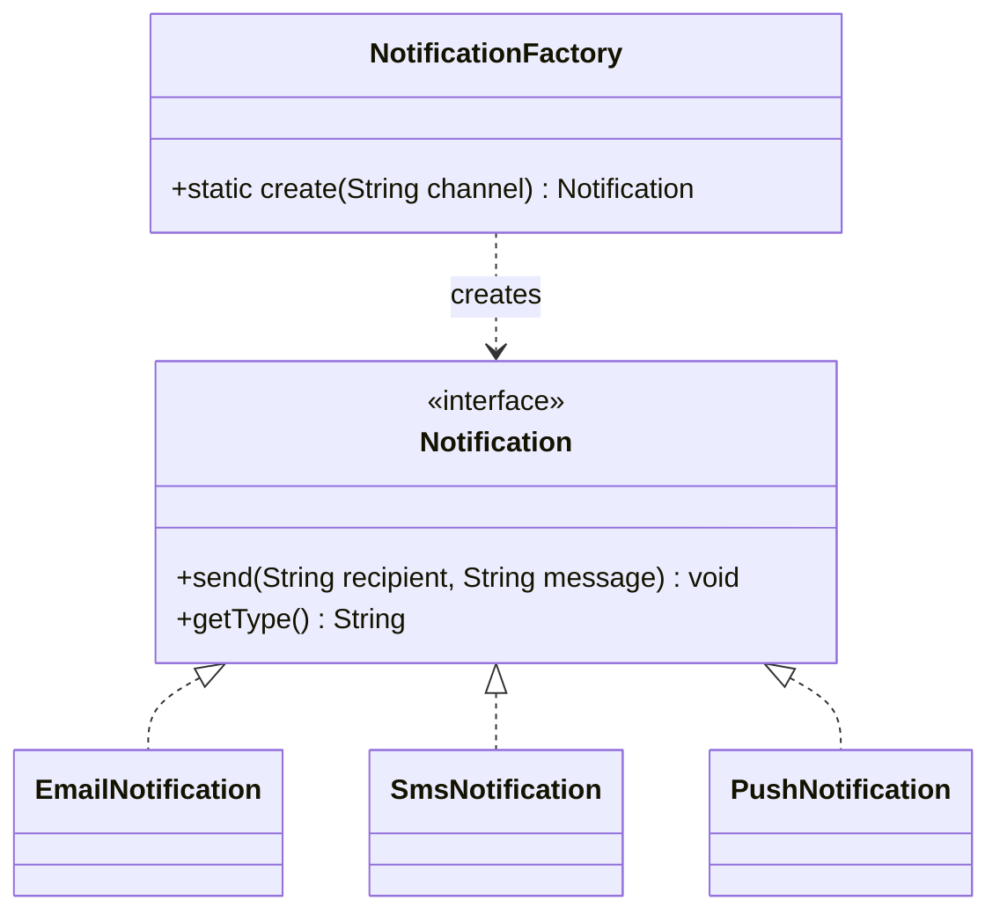
```mermaid
classDiagram
    class Notification {
        <<interface>>
        +send(String recipient, String message) void
        +getType() String
    }
    class EmailNotification
    class SmsNotification
    class PushNotification
    class NotificationFactory {
        +static create(String channel) Notification
    }
    Notification <|.. EmailNotification
    Notification <|.. SmsNotification
    Notification <|.. PushNotification
    NotificationFactory ..> Notification : creates
```

**Key implementation detail:**
```java
public static Notification create(String channel) {
    return switch (channel.toUpperCase()) {
        case "EMAIL" -> new EmailNotification();
        case "SMS"   -> new SmsNotification();
        case "PUSH"  -> new PushNotification();
        default      -> throw new IllegalArgumentException("Unknown channel: " + channel);
    };
}
```

**Demo output:**
```
Email to [user@example.com]: Your order has been shipped!
SMS to [user@example.com]: Your order has been shipped!
Push notification to device [user@example.com]: Your order has been shipped!
```

**Spring Boot in Practice** — `creational/factorymethod/spring/SpringBeanFactory.java`

- Spring's `BeanFactory` and `ApplicationContext` ARE the Factory Method pattern
- `@Bean` methods are factory methods — the caller requests an interface, Spring decides which concrete class to return
- `@ConditionalOnProperty` selects the concrete implementation at startup based on configuration

```java
@Configuration
class NotificationConfig {
    @Bean
    public NotificationSender notificationSender() {
        // factory method — caller only knows NotificationSender, not the concrete type
        return channel.equals("sms") ? new SmsSender() : new EmailSender();
    }
}

// With Spring Cloud conditions:
@Bean
@ConditionalOnProperty(name = "feature.sms", havingValue = "true")
public NotificationSender smsSender() { return new SmsSender(); }
```

---

### 3. Abstract Factory

**Intent:** Provide an interface for creating **families of related objects** without specifying their concrete classes.

**Analogy:** A cross-platform UI toolkit — create Windows-style or macOS-style buttons and checkboxes without the client knowing which platform it's running on.

**When to use:**
- When a system must be independent of how its products are created
- When you want to enforce that products from one family are used together
- Theme systems, cross-platform UI, database driver sets

**Package:** `creational/abstractfactory`

| File | Role |
|------|------|
| `GUIFactory.java` | Abstract factory interface |
| `WindowsFactory.java` | Concrete factory for Windows |
| `MacFactory.java` | Concrete factory for macOS |
| `Button.java` | Abstract product |
| `Checkbox.java` | Abstract product |
| `WindowsButton.java`, `MacButton.java` | Concrete products |
| `WindowsCheckbox.java`, `MacCheckbox.java` | Concrete products |
| `Application.java` | Client that uses the factory |

**Structure:**

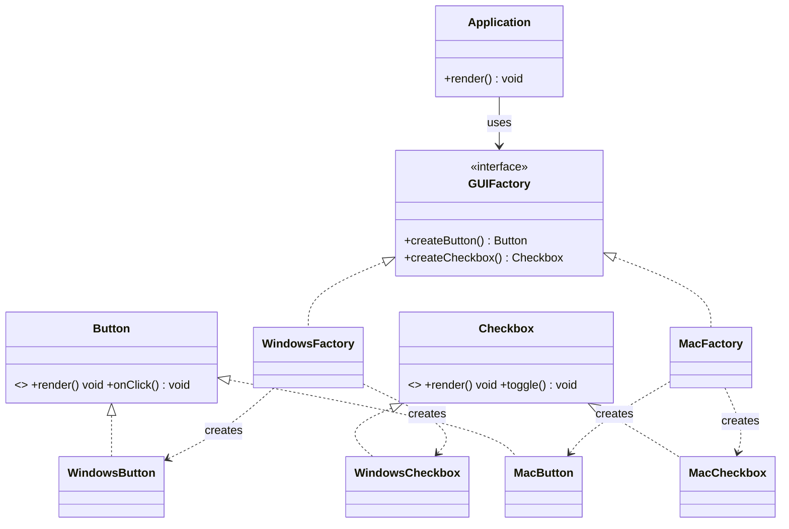
```mermaid
classDiagram
    class GUIFactory {
        <<interface>>
        +createButton() Button
        +createCheckbox() Checkbox
    }
    class Button { <<interface>> +render() void +onClick() void }
    class Checkbox { <<interface>> +render() void +toggle() void }
    class WindowsFactory
    class MacFactory
    class WindowsButton
    class MacButton
    class WindowsCheckbox
    class MacCheckbox
    class Application { +render() void }

    GUIFactory <|.. WindowsFactory
    GUIFactory <|.. MacFactory
    Button <|.. WindowsButton
    Button <|.. MacButton
    Checkbox <|.. WindowsCheckbox
    Checkbox <|.. MacCheckbox
    WindowsFactory ..> WindowsButton : creates
    WindowsFactory ..> WindowsCheckbox : creates
    MacFactory ..> MacButton : creates
    MacFactory ..> MacCheckbox : creates
    Application --> GUIFactory : uses
```

- The client (`Application`) depends only on `GUIFactory`, `Button`, and `Checkbox` — never on a concrete `Windows*`/`Mac*` class
- Swapping the entire UI family is a single-line change: pass a different factory into `Application`'s constructor

**Key implementation detail:**
```java
// Client code never imports concrete classes
public Application(GUIFactory factory) {
    this.button = factory.createButton();
    this.checkbox = factory.createCheckbox();
}
```

**Demo output:**
```
Rendering Windows-style button
Rendering Windows-style checkbox [ ]
Rendering macOS-style button
Rendering macOS-style checkbox [ ]
```

---

### 4. Builder

**Intent:** Separate the construction of a complex object from its representation, allowing the same construction process to create different representations.

**Analogy:** Ordering a customized pizza — you specify each attribute step by step and call `build()` at the end.

**When to use:**
- Objects with many optional parameters (avoid telescoping constructors)
- When construction involves multiple steps
- Immutable objects with complex initialization

**Package:** `creational/builder`

| File | Role |
|------|------|
| `Pizza.java` | Product with inner `Builder` class |

**Structure:**

```mermaid
classDiagram
    class Pizza {
        -String size
        -String crust
        -String sauce
        -List~String~ toppings
        -boolean extraCheese
        -boolean glutenFree
        -Pizza(Builder builder)
        +toString() String
    }
    class Builder {
        +size(String) Builder
        +crust(String) Builder
        +sauce(String) Builder
        +toppings(List~String~) Builder
        +extraCheese(boolean) Builder
        +glutenFree(boolean) Builder
        +build() Pizza
    }
    Pizza +-- Builder : static inner class
    Builder ..> Pizza : constructs
```

- `Pizza`'s constructor is private — the only path to an instance is `new Pizza.Builder()....build()`
- Each fluent setter returns `this`, letting calls chain; `build()` is the single point where validation and construction happen

**Key implementation detail:**
```java
Pizza margherita = new Pizza.Builder()
    .size("Large")
    .crust("Thin")
    .sauce("Tomato")
    .toppings(List.of("Mozzarella", "Basil"))
    .build();
```

- `Pizza` has a private constructor; the only way to create it is through the `Builder`
- The `build()` method validates required fields before constructing the object
- Optional fields retain their defaults when not explicitly set

**Demo output:**
```
Pizza{size=Large, crust=Thin, sauce=Tomato, toppings=[Mozzarella, Basil], extraCheese=false, glutenFree=false}
Pizza{size=Medium, crust=Stuffed, sauce=Pesto, toppings=[Bell Peppers, Mushrooms, Olives], extraCheese=true, glutenFree=true}
```

**Spring Boot in Practice** — `creational/builder/spring/SpringBuilderPatterns.java`

- Spring uses Builder throughout for safe construction of complex configuration objects
- Each builder exposes a fluent API that validates and assembles the target object at `build()` time

```java
// UriComponentsBuilder — safe URI construction
URI uri = UriComponentsBuilder.newInstance()
    .scheme("https").host("api.example.com")
    .path("/orders/{id}").queryParam("status", "ACTIVE")
    .buildAndExpand("ORD-123").toUri();

// WebClient.Builder (Spring WebFlux)
WebClient client = WebClient.builder()
    .baseUrl("https://api.example.com")
    .defaultHeader(HttpHeaders.AUTHORIZATION, "Bearer " + token)
    .filter(logRequest())
    .build();

// RestTemplateBuilder
RestTemplate template = new RestTemplateBuilder()
    .rootUri("https://api.example.com")
    .connectTimeout(Duration.ofSeconds(5))
    .readTimeout(Duration.ofSeconds(10))
    .build();

// SpringApplicationBuilder — hierarchical contexts
new SpringApplicationBuilder()
    .parent(ParentConfig.class).child(ChildConfig.class).run(args);
```

---

### 5. Prototype

**Intent:** Specify the kinds of objects to create using a prototypical instance, and create new objects by **copying** this prototype.

**Analogy:** A graphics editor that clones existing shapes rather than constructing from scratch — especially useful when construction is expensive.

**When to use:**
- When object creation is costly (database lookups, complex initialization)
- When you need many instances that differ only slightly
- Copy-on-write scenarios

**Package:** `creational/prototype`

| File | Role |
|------|------|
| `Shape.java` | Abstract prototype with copy constructor |
| `Circle.java` | Concrete prototype |
| `Rectangle.java` | Concrete prototype |
| `ShapeRegistry.java` | Cache of prototype instances |

**Structure:**

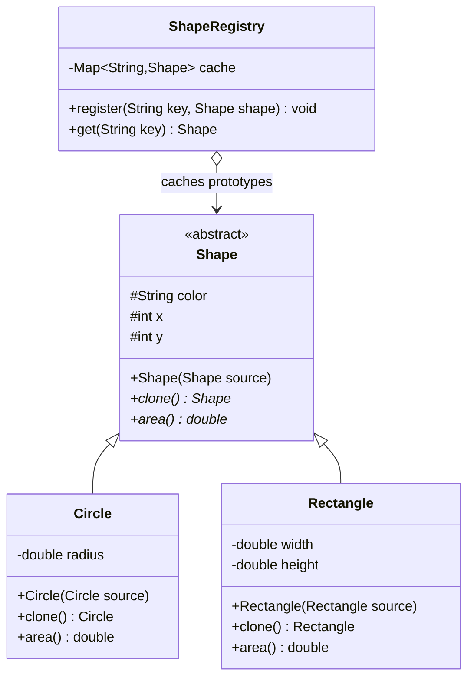
```mermaid
classDiagram
    class Shape {
        <<abstract>>
        #String color
        #int x
        #int y
        +Shape(Shape source)
        +clone() Shape*
        +area() double*
    }
    class Circle {
        -double radius
        +Circle(Circle source)
        +clone() Circle
        +area() double
    }
    class Rectangle {
        -double width
        -double height
        +Rectangle(Rectangle source)
        +clone() Rectangle
        +area() double
    }
    class ShapeRegistry {
        -Map~String,Shape~ cache
        +register(String key, Shape shape) void
        +get(String key) Shape
    }
    Shape <|-- Circle
    Shape <|-- Rectangle
    ShapeRegistry o--> Shape : caches prototypes
```

- Every concrete shape implements `clone()` via a **copy constructor** (`Circle(Circle source)`), not `Object.clone()` — each field is explicitly copied so deep-copy intent is visible in code, not hidden behind bitwise copy semantics
- `ShapeRegistry.get(key)` returns a fresh clone of the cached prototype, so callers never mutate the shared template

**Key implementation detail:**
```java
// Copy constructor — deep clone via constructor, not Object.clone()
public Circle(Circle source) {
    super(source);
    if (source != null) this.radius = source.radius;
}

@Override
public Circle clone() {
    return new Circle(this);
}
```

- Uses copy constructors instead of `Cloneable` to avoid Java's shallow `Object.clone()` pitfalls
- Each field is explicitly copied, making deep-copy intent visible and verifiable

**Demo output:**
```
Original: Circle{radius=5.0, color=Red, area=78.54}
Clone (modified): Circle{radius=5.0, color=Green, area=78.54}
Same instance? false
```

**Spring Boot in Practice** — `creational/prototype/spring/SpringPrototypeBean.java`

```java
@Component
@Scope(ConfigurableBeanFactory.SCOPE_PROTOTYPE)  // new instance on every getBean()
class ShoppingCart { ... }

// Correct way to get a fresh prototype inside a singleton:
@Service
class CheckoutService {
    @Autowired ApplicationContext context;

    public ShoppingCart createCart() {
        return context.getBean(ShoppingCart.class);  // brand new each call
    }
}

// Or use Provider<T> (JSR-330):
@Autowired Provider<ShoppingCart> cartProvider;
ShoppingCart fresh = cartProvider.get();  // new instance each time
```

> **Gotcha:** injecting a `@Scope("prototype")` bean directly via `@Autowired` into a singleton only creates ONE instance. Always use `ApplicationContext.getBean()` or `Provider<T>` for true per-call creation.

---

## Structural Patterns

- Deal with **object composition**, creating relationships between objects to form larger structures
- Keep structures flexible and efficient while allowing parts to vary independently
- Seven patterns covering wrapping, bridging, grouping, and access control

---

### 6. Adapter

**Intent:** Convert the interface of a class into another interface that clients expect. Lets incompatible interfaces work together.

**Analogy:** An audio player that natively plays MP3 but needs to play VLC and MP4 files — the `MediaAdapter` bridges the gap.

**When to use:**
- Integrating legacy code with new interfaces
- Using third-party libraries with incompatible APIs
- Wrapping external services

**Package:** `structural/adapter`

| File | Role |
|------|------|
| `MediaPlayer.java` | Target interface (client uses this) |
| `AdvancedMediaPlayer.java` | Adaptee interface (incompatible) |
| `VlcPlayer.java`, `Mp4Player.java` | Concrete adaptees |
| `MediaAdapter.java` | Adapter — wraps adaptee, implements target |
| `AudioPlayer.java` | Client — uses `MediaPlayer`, delegates to adapter |

**Structure:**

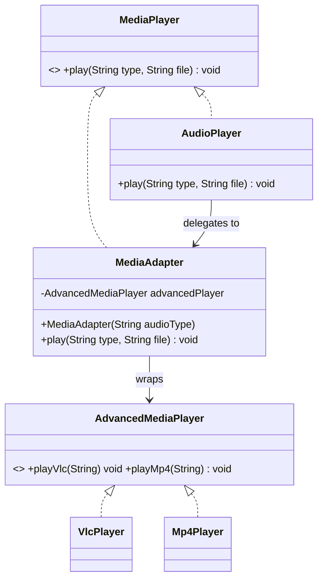
```mermaid
classDiagram
    class MediaPlayer { <<interface>> +play(String type, String file) void }
    class AdvancedMediaPlayer { <<interface>> +playVlc(String) void +playMp4(String) void }
    class VlcPlayer
    class Mp4Player
    class MediaAdapter {
        -AdvancedMediaPlayer advancedPlayer
        +MediaAdapter(String audioType)
        +play(String type, String file) void
    }
    class AudioPlayer { +play(String type, String file) void }

    MediaPlayer <|.. MediaAdapter
    MediaPlayer <|.. AudioPlayer
    AdvancedMediaPlayer <|.. VlcPlayer
    AdvancedMediaPlayer <|.. Mp4Player
    MediaAdapter --> AdvancedMediaPlayer : wraps
    AudioPlayer --> MediaAdapter : delegates to
```

- `AudioPlayer` only ever calls `MediaPlayer.play(...)` — it has no idea `VlcPlayer`/`Mp4Player` exist
- `MediaAdapter` is the sole class that knows both interfaces; it translates the `MediaPlayer` call into the matching `AdvancedMediaPlayer` call

**Key implementation detail:**
```java
public class MediaAdapter implements MediaPlayer {
    private final AdvancedMediaPlayer advancedPlayer;

    public MediaAdapter(String audioType) {
        this.advancedPlayer = switch (audioType.toLowerCase()) {
            case "vlc" -> new VlcPlayer();
            case "mp4" -> new Mp4Player();
            default    -> throw new IllegalArgumentException("Unsupported: " + audioType);
        };
    }
}
```

**Demo output:**
```
Playing MP3 file: song.mp3
Playing VLC file: movie.vlc
Playing MP4 file: video.mp4
Unsupported format: avi
```

**Spring Boot in Practice** — `structural/adapter/spring/SpringJdbcAdapter.java`

- Every Spring `*Template` class is an Adapter — it translates a clean high-level call into a verbose low-level API call
- Without the adapter, every caller would need to manage connections, statements, and error handling manually

```java
// JdbcTemplate adapts raw JDBC — 15-line boilerplate becomes 1 line
List<Order> orders = jdbcTemplate.query(
    "SELECT * FROM orders WHERE status = ?",
    (rs, row) -> new Order(rs.getLong("id"), rs.getString("status")),
    "ACTIVE"
);

// Other template adapters follow the exact same pattern:
// MongoTemplate  → mongoTemplate.find(query, Order.class)
// RedisTemplate  → redisTemplate.opsForValue().set(key, value)
// KafkaTemplate  → kafkaTemplate.send(topic, key, payload)
// AmqpTemplate   → amqpTemplate.convertAndSend(exchange, routingKey, message)
// RestTemplate   → restTemplate.getForObject(url, Order.class)
```

---

### 7. Bridge

**Intent:** Decouple an abstraction from its implementation so that the two can vary independently.

**Analogy:** Drawing shapes (abstraction) with different rendering APIs like SVG or Canvas (implementation). New shapes and new APIs can be added independently.

**When to use:**
- When you want to avoid a permanent binding between abstraction and implementation
- When both abstractions and implementations should be extensible via subclassing
- Switching between SQL and NoSQL databases, different rendering engines

**Package:** `structural/bridge`

| File | Role |
|------|------|
| `DrawingAPI.java` | Implementor interface |
| `SvgDrawingAPI.java`, `CanvasDrawingAPI.java` | Concrete implementors |
| `Shape.java` | Abstraction — holds reference to `DrawingAPI` |
| `CircleShape.java` | Refined abstraction |

**Structure:**

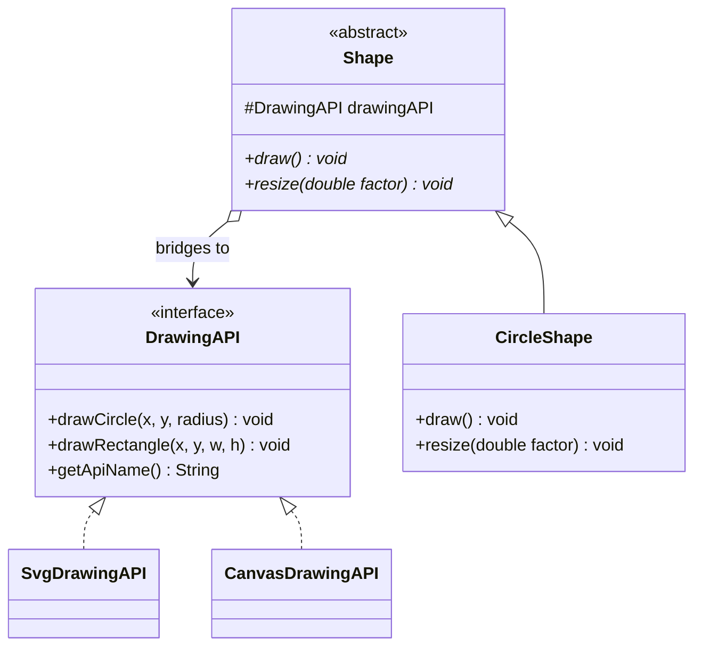
```mermaid
classDiagram
    class DrawingAPI {
        <<interface>>
        +drawCircle(x, y, radius) void
        +drawRectangle(x, y, w, h) void
        +getApiName() String
    }
    class SvgDrawingAPI
    class CanvasDrawingAPI
    class Shape {
        <<abstract>>
        #DrawingAPI drawingAPI
        +draw() void*
        +resize(double factor) void*
    }
    class CircleShape {
        +draw() void
        +resize(double factor) void
    }
    DrawingAPI <|.. SvgDrawingAPI
    DrawingAPI <|.. CanvasDrawingAPI
    Shape <|-- CircleShape
    Shape o--> DrawingAPI : bridges to
```

- `Shape` (the abstraction hierarchy) and `DrawingAPI` (the implementation hierarchy) vary **independently**: a new shape (e.g. `SquareShape`) or a new rendering API (e.g. `OpenGlDrawingAPI`) can be added without touching the other hierarchy
- The "bridge" is the `drawingAPI` field — composition instead of inheritance is what decouples the two axes of variation

**Key implementation detail:**
```java
// Abstraction holds a reference to the implementor (bridge)
public abstract class Shape {
    protected final DrawingAPI drawingAPI;
    // ...
}

// Client composes abstraction + implementor at runtime
Shape svgCircle = new CircleShape(10, 20, 5, new SvgDrawingAPI());
Shape canvasCircle = new CircleShape(10, 20, 5, new CanvasDrawingAPI());
```

**Demo output:**
```
SVG: <circle cx='10.0' cy='20.0' r='5.0'/>
Canvas: ctx.arc(10.0, 20.0, 5.0, 0, 2*Math.PI)
SVG: <circle cx='10.0' cy='20.0' r='10.0'/>
```

---

### 8. Composite

**Intent:** Compose objects into **tree structures** to represent part-whole hierarchies. Lets clients treat individual objects and compositions uniformly.

**Analogy:** A file system — a directory can contain files or other directories; both expose the same `getSize()` and `print()` interface.

**When to use:**
- Tree structures (org charts, menus, DOM, file systems)
- When clients should ignore the difference between individual objects and compositions

**Package:** `structural/composite`

| File | Role |
|------|------|
| `FileSystemComponent.java` | Component interface |
| `File.java` | Leaf node |
| `Directory.java` | Composite node — contains children |

**Structure:**

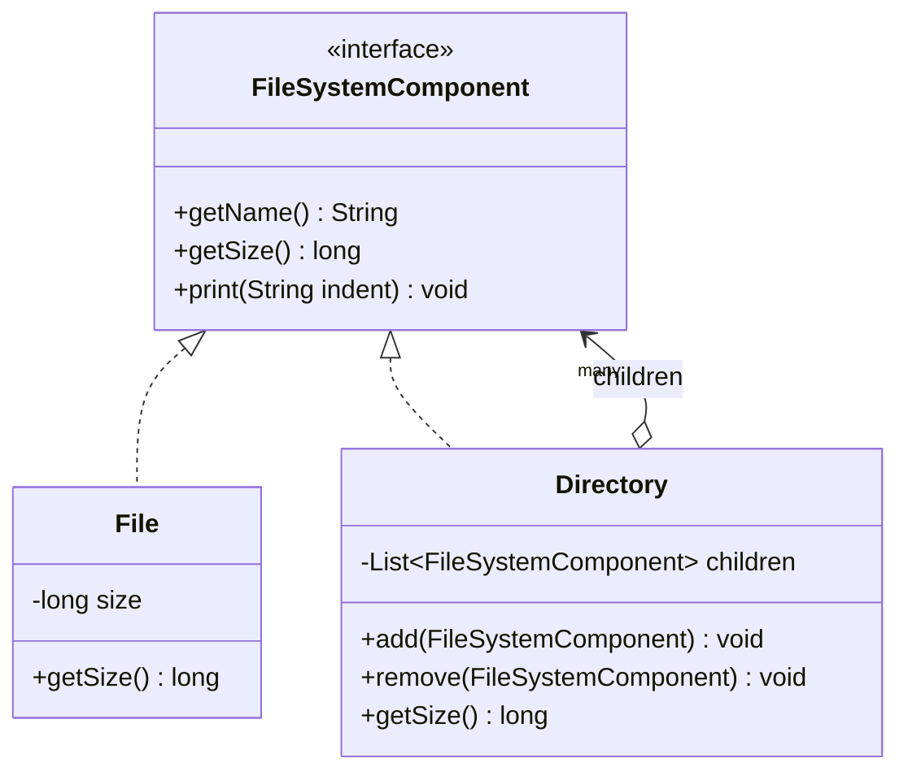
```mermaid
classDiagram
    class FileSystemComponent {
        <<interface>>
        +getName() String
        +getSize() long
        +print(String indent) void
    }
    class File {
        -long size
        +getSize() long
    }
    class Directory {
        -List~FileSystemComponent~ children
        +add(FileSystemComponent) void
        +remove(FileSystemComponent) void
        +getSize() long
    }
    FileSystemComponent <|.. File
    FileSystemComponent <|.. Directory
    Directory o--> "many" FileSystemComponent : children
```

- `Directory` implements the same `FileSystemComponent` interface as `File`, and can itself hold other `Directory` instances — this is what makes the structure recursive
- `getSize()` on a `Directory` doesn't know or care whether each child is a `File` or another `Directory`; it just sums `child.getSize()` for all children, and the recursion falls out naturally

**Key implementation detail:**
```java
// Directory's size is the recursive sum of all children
@Override
public long getSize() {
    return children.stream().mapToLong(FileSystemComponent::getSize).sum();
}
```

**Demo output:**
```
+ root/ (7680 bytes)
  + src/ (2560 bytes)
    - Main.java (2048 bytes)
    - Config.java (512 bytes)
  + test/ (1024 bytes)
    - MainTest.java (1024 bytes)
  - pom.xml (4096 bytes)
Total size: 7680 bytes
```

**Spring Boot in Practice** — `structural/composite/spring/SpringCompositePropertySource.java`

- Spring's `Environment` IS a Composite of `PropertySource` leaves
- Spring Boot merges many sources transparently — application code just calls `env.getProperty("key")`
- Sources are checked in priority order; first match wins

```java
// Spring checks sources in priority order — first match wins:
// 1. Command-line args      --server.port=9090
// 2. System env vars        SERVER_PORT=9090
// 3. application-prod.yml  server.port: 9090
// 4. application.yml       server.port: 8080  ← overridden by above

// Spring Cloud Config adds a remote CompositePropertySource at priority #2:
// → all properties from the Config Server are merged into the same Environment
// → no code change needed in any service

// Reading is always the same regardless of source:
@Value("${server.port}")
private int port;
```

---

### 9. Decorator

**Intent:** Attach additional responsibilities to an object dynamically. Decorators provide a flexible alternative to subclassing for extending functionality.

**Analogy:** A coffee shop — start with `SimpleCoffee` and wrap it with `MilkDecorator`, `SugarDecorator`, or `VanillaDecorator`, each adding to the description and cost.

**When to use:**
- Adding behavior to individual objects without affecting others of the same class
- When subclassing leads to an explosion of classes
- Java I/O streams (`BufferedReader` wrapping `FileReader`)

**Package:** `structural/decorator`

| File | Role |
|------|------|
| `Coffee.java` | Component interface |
| `SimpleCoffee.java` | Concrete component |
| `CoffeeDecorator.java` | Abstract decorator — wraps a `Coffee` |
| `MilkDecorator.java`, `SugarDecorator.java`, `VanillaDecorator.java` | Concrete decorators |

**Structure:**

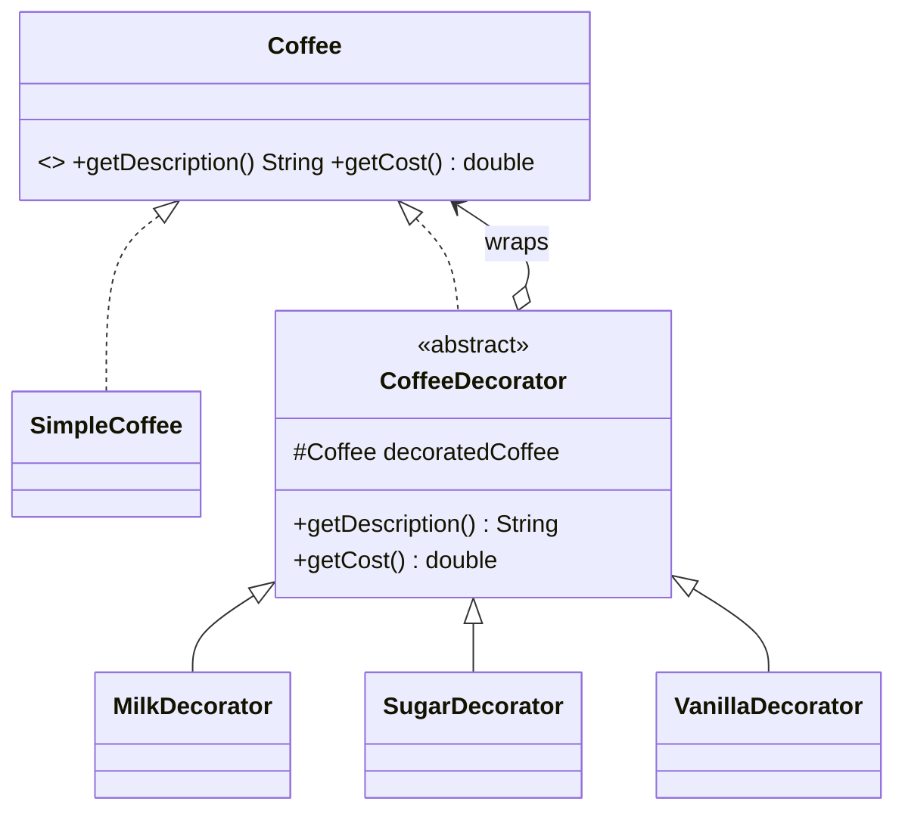
```mermaid
classDiagram
    class Coffee { <<interface>> +getDescription() String +getCost() double }
    class SimpleCoffee
    class CoffeeDecorator {
        <<abstract>>
        #Coffee decoratedCoffee
        +getDescription() String
        +getCost() double
    }
    class MilkDecorator
    class SugarDecorator
    class VanillaDecorator

    Coffee <|.. SimpleCoffee
    Coffee <|.. CoffeeDecorator
    CoffeeDecorator <|-- MilkDecorator
    CoffeeDecorator <|-- SugarDecorator
    CoffeeDecorator <|-- VanillaDecorator
    CoffeeDecorator o--> Coffee : wraps
```

- `CoffeeDecorator` implements `Coffee` **and** holds a `Coffee` reference — so decorators can wrap a `SimpleCoffee` or wrap **each other**, stacking arbitrarily deep (`new SugarDecorator(new MilkDecorator(new SimpleCoffee()))`)
- Each concrete decorator calls through to `decoratedCoffee.getCost()` first, then adds its own delta — the same recursive-delegation shape Java's `java.io` streams use

**Key implementation detail:**
```java
// Decorators wrap the component and delegate, then add their own behavior
public class MilkDecorator extends CoffeeDecorator {
    @Override
    public String getDescription() {
        return decoratedCoffee.getDescription() + ", Milk";
    }
    @Override
    public double getCost() {
        return decoratedCoffee.getCost() + 0.25;
    }
}
```

**Demo output:**
```
Simple Coffee -> $1.00
Simple Coffee, Milk -> $1.25
Simple Coffee, Milk, Sugar -> $1.35
Simple Coffee, Milk, Sugar, Vanilla -> $1.85
```

**Spring Boot in Practice** — `structural/decorator/spring/SpringResilience4jDecorator.java`

- Resilience4j wraps service calls in decorator layers — each annotation stacks another decorator around your method without modifying it
- Java I/O uses the same pattern: each layer wraps the one inside it and adds one capability

```java
@Service
class InventoryService {

    @CircuitBreaker(name = "inventory", fallbackMethod = "fallback")
    @Retry(name = "inventory")
    @RateLimiter(name = "inventory")
    @Bulkhead(name = "inventory")
    public String checkStock(String productId) {
        return downstreamClient.getStock(productId);  // real call
    }

    // called automatically when circuit is open or retries exhausted
    public String fallback(String productId, Exception e) {
        return "UNAVAILABLE";
    }
}

// Java I/O uses the same stacking:
new BufferedReader(new InputStreamReader(new FileInputStream("data.txt")))
// FileInputStream → InputStreamReader → BufferedReader
// each layer decorates the one inside it
```

---

### 10. Facade

**Intent:** Provide a simplified interface to a complex subsystem.

**Analogy:** A home theater system with a DVD player, projector, sound system, and lights. Instead of operating each device separately, a `HomeTheaterFacade` provides `watchMovie()` and `endMovie()`.

**When to use:**
- Providing a simple interface to a complex library or framework
- Layered architecture (service layer as facade over repositories and external APIs)
- Reducing dependencies between client and subsystem

**Package:** `structural/facade`

| File | Role |
|------|------|
| `DVDPlayer.java`, `Projector.java`, `SoundSystem.java`, `Lights.java` | Complex subsystem components |
| `HomeTheaterFacade.java` | Facade — orchestrates all subsystems |

**Structure:**

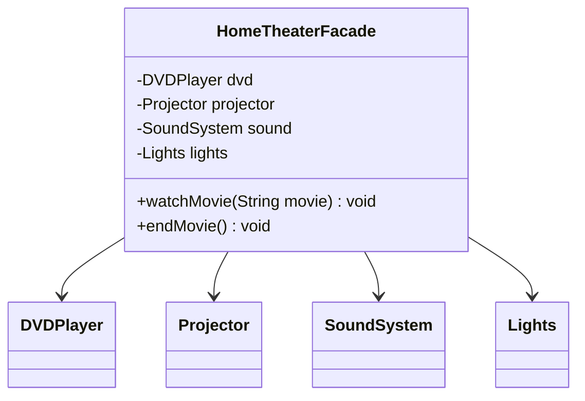
```mermaid
classDiagram
    class HomeTheaterFacade {
        -DVDPlayer dvd
        -Projector projector
        -SoundSystem sound
        -Lights lights
        +watchMovie(String movie) void
        +endMovie() void
    }
    class DVDPlayer
    class Projector
    class SoundSystem
    class Lights

    HomeTheaterFacade --> DVDPlayer
    HomeTheaterFacade --> Projector
    HomeTheaterFacade --> SoundSystem
    HomeTheaterFacade --> Lights
```

- The client calls exactly two methods — `watchMovie()` / `endMovie()` — instead of coordinating four subsystem objects and their correct call order itself
- The subsystem classes (`DVDPlayer`, `Projector`, `SoundSystem`, `Lights`) are unaware the facade exists — they can still be used directly if fine-grained control is needed

**Key implementation detail:**
```java
public void watchMovie(String movie) {
    lights.dim(10);
    projector.on();
    projector.setWideScreenMode();
    sound.on();
    sound.setSurroundSound();
    sound.setVolume(8);
    dvd.on();
    dvd.play(movie);
}
```

**Demo output:**
```
--- Getting ready to watch: Inception ---
Lights: Dimmed to 10%
Projector: ON
...
DVD Player: Playing 'Inception'
```

---

### 11. Flyweight

**Intent:** Use sharing to efficiently support a large number of **fine-grained objects**. Separates shared intrinsic state from unique extrinsic state.

**Analogy:** Rendering a forest with thousands of trees — the species/texture (`TreeType`) is shared; position (`x, y`) is per-tree.

**When to use:**
- Large numbers of similar objects consuming too much memory
- Game engines (particles, tiles, characters)
- Font glyph rendering, string interning

**Package:** `structural/flyweight`

| File | Role |
|------|------|
| `TreeType.java` | Flyweight — shared intrinsic state (name, color, texture) |
| `Tree.java` | Context — holds extrinsic state (x, y) + reference to flyweight |
| `TreeFactory.java` | Flyweight factory with cache |
| `Forest.java` | Client |

**Structure:**

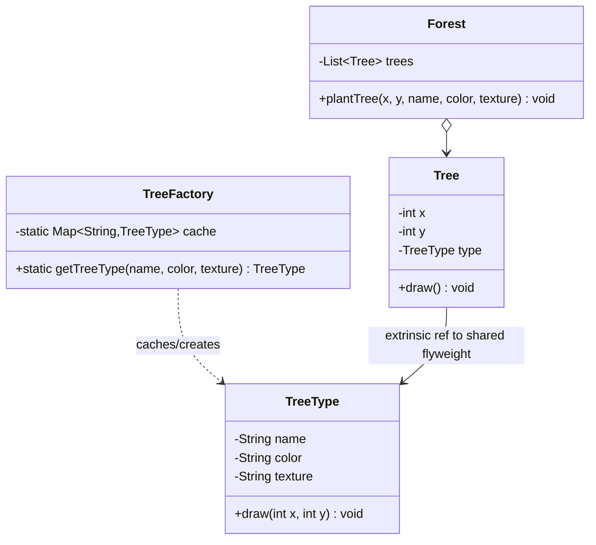
```mermaid
classDiagram
    class TreeType {
        -String name
        -String color
        -String texture
        +draw(int x, int y) void
    }
    class TreeFactory {
        -static Map~String,TreeType~ cache
        +static getTreeType(name, color, texture) TreeType
    }
    class Tree {
        -int x
        -int y
        -TreeType type
        +draw() void
    }
    class Forest {
        -List~Tree~ trees
        +plantTree(x, y, name, color, texture) void
    }
    TreeFactory ..> TreeType : caches/creates
    Tree --> TreeType : extrinsic ref to shared flyweight
    Forest o--> Tree
```

- `TreeType` holds only the **intrinsic** state shared across many trees (species, color, texture); `Tree` holds the **extrinsic** state unique per instance (`x`, `y`) plus a reference to its shared `TreeType`
- `TreeFactory.getTreeType(...)` uses `computeIfAbsent` keyed by `name-color-texture`, so planting 8 trees of 2 species allocates only 2 `TreeType` objects total

**Key implementation detail:**
```java
// Only 2 TreeType objects created for 8 trees
public static TreeType getTreeType(String name, String color, String texture) {
    String key = name + "-" + color + "-" + texture;
    return cache.computeIfAbsent(key, k -> new TreeType(name, color, texture));
}
```

**Demo output:**
```
TreeType created: Oak
TreeType created: Pine
...
Unique TreeType objects created: 2 (for 8 trees)
```

---

### 12. Proxy

**Intent:** Provide a surrogate or placeholder for another object to control access to it.

**Analogy:** Lazy-loading images — the `ProxyImage` holds the filename and only loads the actual image from disk when `display()` is first called.

**When to use:**
- Virtual proxy: defer expensive initialization (lazy loading)
- Protection proxy: control access based on permissions
- Remote proxy: hide remote call complexity
- Caching proxy: cache results of expensive operations

**Package:** `structural/proxy`

| File | Role |
|------|------|
| `Image.java` | Subject interface |
| `RealImage.java` | Real subject — expensive to create |
| `ProxyImage.java` | Proxy — controls access, lazy-loads `RealImage` |

**Structure:**

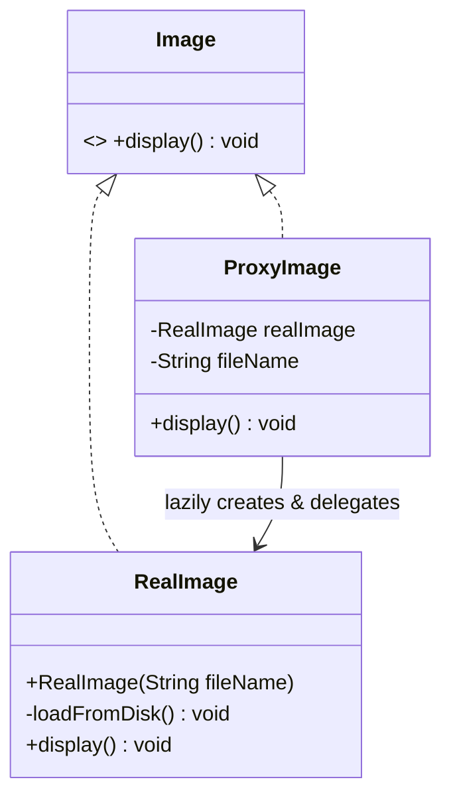
```mermaid
classDiagram
    class Image { <<interface>> +display() void }
    class RealImage {
        +RealImage(String fileName)
        -loadFromDisk() void
        +display() void
    }
    class ProxyImage {
        -RealImage realImage
        -String fileName
        +display() void
    }
    Image <|.. RealImage
    Image <|.. ProxyImage
    ProxyImage --> RealImage : lazily creates & delegates
```

- `ProxyImage` implements the same `Image` interface as `RealImage`, so client code is identical whether it holds a proxy or the real subject
- `RealImage` is only constructed — and only then does the expensive disk load happen — the first time `display()` is called on the proxy; subsequent calls reuse the cached `realImage`

**Key implementation detail:**
```java
@Override
public void display() {
    if (realImage == null) {
        realImage = new RealImage(fileName); // loaded only on first call
    }
    realImage.display();
}
```

**Demo output:**
```
Image object created, but not yet loaded.
First display call:
RealImage: Loading 'photo.jpg' from disk...
RealImage: Displaying 'photo.jpg'
Second display call (no disk load):
RealImage: Displaying 'photo.jpg'
```

**Spring Boot in Practice** — `structural/proxy/spring/SpringAopProxy.java`

- Spring AOP IS the Proxy pattern
- Every `@Transactional`, `@Async`, `@Cacheable`, or `@Aspect` annotation instructs Spring to wrap the bean in a CGLIB or JDK dynamic proxy
- The proxy intercepts the method call, runs the cross-cutting concern, then delegates to the real object

```java
@Service
class OrderService {

    @Transactional          // proxy: begin → execute → commit/rollback
    public void placeOrder(String orderId) { ... }

    @Async("taskExecutor")  // proxy: submit to thread pool, return CompletableFuture
    public CompletableFuture<Void> sendConfirmation(String orderId) { ... }

    @Cacheable(value = "orders", key = "#orderId")  // proxy: cache hit → skip method body
    public Order findById(String orderId) { ... }
}

// What Spring injects is NOT OrderService — it's a proxy:
// orderService.getClass().getName()
// → "com.example.OrderService$$SpringCGLIB$$0"
```

---

## Behavioral Patterns

- Deal with **communication between objects**, defining how objects interact and distribute responsibility
- Eleven patterns covering request routing, state change notification, algorithm selection, and more

---

### 13. Chain of Responsibility

**Intent:** Pass requests along a chain of handlers. Each handler either handles the request or passes it to the next handler.

**Analogy:** Customer support tiers — a ticket goes to L1; if unresolved, escalates to L2, then L3.

**When to use:**
- More than one object may handle a request
- Request handlers are unknown a priori
- Middleware pipelines, event handling, logging filters

**Package:** `behavioral/chainofresponsibility`

| File | Role |
|------|------|
| `SupportHandler.java` | Abstract handler with `setNext()` and `escalate()` |
| `SupportTicket.java` | Request object |
| `Level1Support.java`, `Level2Support.java`, `Level3Support.java` | Concrete handlers |

**Structure:**

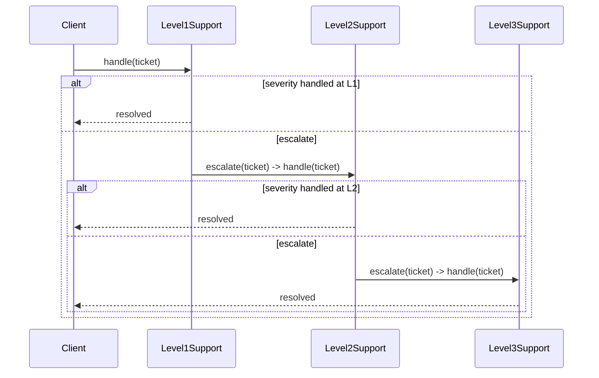
```mermaid
sequenceDiagram
    participant Client
    participant L1 as Level1Support
    participant L2 as Level2Support
    participant L3 as Level3Support

    Client->>L1: handle(ticket)
    alt severity handled at L1
        L1-->>Client: resolved
    else escalate
        L1->>L2: escalate(ticket) -> handle(ticket)
        alt severity handled at L2
            L2-->>Client: resolved
        else escalate
            L2->>L3: escalate(ticket) -> handle(ticket)
            L3-->>Client: resolved
        end
    end
```

- Each handler only decides two things: "can I resolve this?" and, if not, "who is next?" — it never needs to know the full chain or how many handlers follow it
- `setNext()` returns the next handler, enabling the fluent `l1.setNext(l2).setNext(l3)` construction seen in the demo

**Key implementation detail:**
```java
// Fluent chaining
Level1Support l1 = new Level1Support();
l1.setNext(new Level2Support()).setNext(new Level3Support());
l1.handle(ticket);
```

**Demo output:**
```
L1 Support resolved ticket #1: Password reset
L1 escalating ticket #2...
L2 Support resolved ticket #2: Account billing issue
L1 escalating ticket #3...
L2 escalating ticket #3...
L3 Engineering resolved ticket #3: Data corruption in prod
```

**Spring Boot in Practice** — `behavioral/chainofresponsibility/spring/SpringSecurityFilterChain.java`

- Spring Security's filter chain IS Chain of Responsibility
- Each `Filter` handles one concern and calls `chain.doFilter()` to pass the request forward — or short-circuits with an error response
- Spring Cloud Gateway route filters use the same pattern at the API gateway level

```java
@Bean
public SecurityFilterChain filterChain(HttpSecurity http) throws Exception {
    return http
        .csrf(AbstractHttpConfigurer::disable)
        .addFilterBefore(jwtAuthFilter, UsernamePasswordAuthenticationFilter.class)
        .authorizeHttpRequests(auth -> auth
            .requestMatchers("/public/**").permitAll()
            .anyRequest().authenticated())
        .build();
    // Request path: JwtAuthFilter → UsernamePasswordAuthFilter → ExceptionTranslationFilter → endpoint
}

// Spring Cloud Gateway route filters — same pattern, different domain:
// AuthFilter → RateLimitFilter → CircuitBreakerFilter → RouteFilter → downstream service
```

---

### 14. Command

**Intent:** Encapsulate a request as an object, enabling parameterization, queuing, logging, and undo/redo.

**Analogy:** A smart home remote control — pressing a button executes a `Command`; pressing undo reverses the last command.

**When to use:**
- Undo/redo functionality
- Transaction queuing and scheduling
- Macro recording
- GUI button actions

**Package:** `behavioral/command`

| File | Role |
|------|------|
| `Command.java` | Command interface with `execute()` and `undo()` |
| `Light.java` | Receiver |
| `LightOnCommand.java`, `LightOffCommand.java` | Concrete commands |
| `RemoteControl.java` | Invoker — maintains command history |

**Structure:**

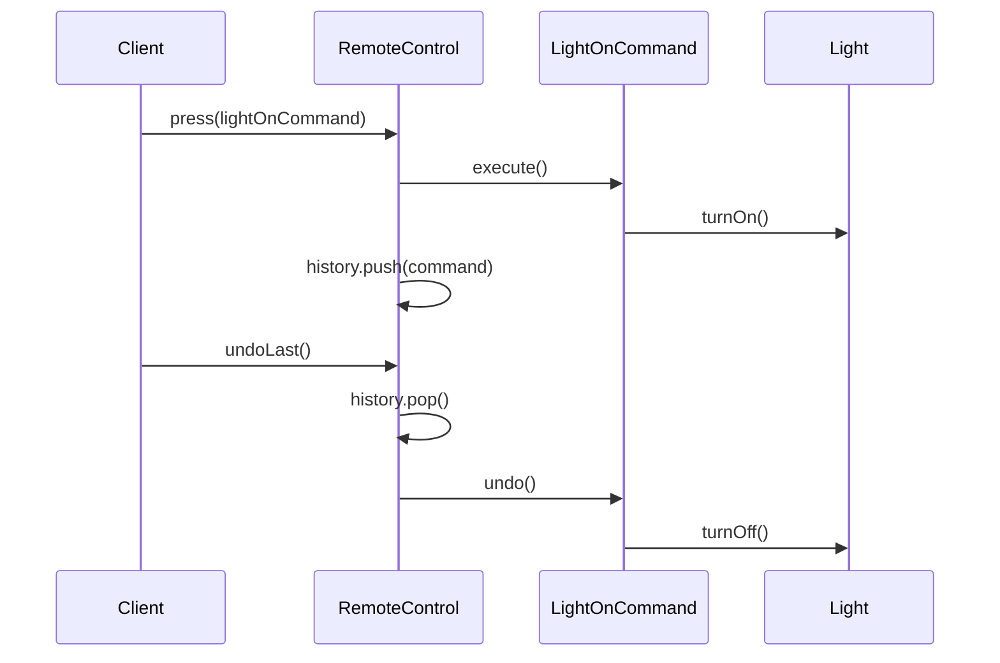
```mermaid
sequenceDiagram
    participant Client
    participant Remote as RemoteControl
    participant Cmd as LightOnCommand
    participant Light

    Client->>Remote: press(lightOnCommand)
    Remote->>Cmd: execute()
    Cmd->>Light: turnOn()
    Remote->>Remote: history.push(command)

    Client->>Remote: undoLast()
    Remote->>Remote: history.pop()
    Remote->>Cmd: undo()
    Cmd->>Light: turnOff()
```

- `RemoteControl` (the invoker) never references `Light` (the receiver) directly — it only knows the `Command` interface, so any new command can be added without changing the invoker
- Each concrete command captures its receiver and the exact action, which is what makes `undo()` possible: the command remembers how to reverse itself

**Key implementation detail:**
```java
// Invoker stores history for undo
public void press(Command command) {
    command.execute();
    history.push(command);
}

public void undoLast() {
    if (!history.isEmpty()) {
        history.pop().undo();
    }
}
```

**Demo output:**
```
Living Room light: ON
Bedroom light: ON
Living Room light: OFF
-- Undo --
Undo -> Living Room light: ON
Undo -> Bedroom light: OFF
```

---

### 15. Iterator

**Intent:** Provide a way to **sequentially access** elements of a collection without exposing its internal representation.

**Analogy:** A library catalog that can be traversed forward or in reverse, regardless of how books are stored internally.

**When to use:**
- Uniform traversal over different collection types
- Multiple simultaneous traversals needed
- Supporting different traversal strategies (forward, reverse, filtered)

**Package:** `behavioral/iterator`

| File | Role |
|------|------|
| `Book.java` | Element type |
| `BookCollection.java` | Aggregate — implements `Iterable<Book>`, provides forward and reverse iterators |

**Structure:**

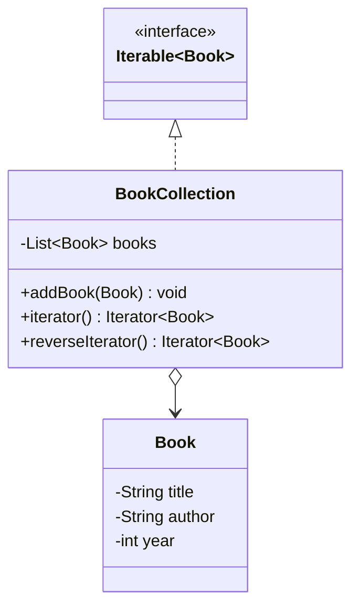
```mermaid
classDiagram
    class Iterable~Book~ { <<interface>> }
    class BookCollection {
        -List~Book~ books
        +addBook(Book) void
        +iterator() Iterator~Book~
        +reverseIterator() Iterator~Book~
    }
    class Book {
        -String title
        -String author
        -int year
    }
    Iterable <|.. BookCollection
    BookCollection o--> Book
```

- `BookCollection` implements `java.lang.Iterable<Book>`, so it plugs directly into Java's for-each syntax while hiding the underlying `ArrayList<Book>`
- `reverseIterator()` returns a second, independent traversal strategy over the same backing list, demonstrating that a single aggregate can expose multiple iteration orders without exposing its storage

**Key implementation detail:**
```java
// Standard iterator — works with for-each
for (Book book : library) { ... }

// Custom reverse iterator
var iter = library.reverseIterator();
while (iter.hasNext()) { System.out.println(iter.next()); }
```

---

### 16. Mediator

**Intent:** Define an object that encapsulates how a set of objects interact. Reduces direct references between objects, promoting loose coupling.

**Analogy:** A chat room — users don't send messages directly to each other; they send through the `ChatRoom` mediator, which dispatches to all other participants.

**When to use:**
- Many-to-many interactions between objects lead to tight coupling
- Air traffic control systems
- UI forms where fields interact

**Package:** `behavioral/mediator`

| File | Role |
|------|------|
| `ChatMediator.java` | Mediator interface |
| `ChatRoom.java` | Concrete mediator |
| `ChatUser.java` | Abstract colleague |
| `ConcreteUser.java` | Concrete colleague |

**Structure:**

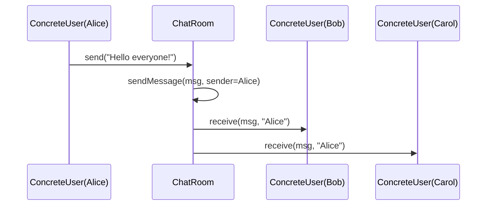
```mermaid
sequenceDiagram
    participant Alice as ConcreteUser(Alice)
    participant Room as ChatRoom
    participant Bob as ConcreteUser(Bob)
    participant Carol as ConcreteUser(Carol)

    Alice->>Room: send("Hello everyone!")
    Room->>Room: sendMessage(msg, sender=Alice)
    Room->>Bob: receive(msg, "Alice")
    Room->>Carol: receive(msg, "Alice")
```

- `ConcreteUser` instances never hold references to each other — only to the shared `ChatMediator` — collapsing what would be N² direct relationships into N relationships with a single mediator
- `ChatRoom.sendMessage()` filters the sender out of the broadcast (`users.stream().filter(u -> u != sender)`), so a user never receives its own message back

**Key implementation detail:**
```java
// ChatRoom dispatches to everyone except the sender
@Override
public void sendMessage(String message, ChatUser sender) {
    users.stream()
         .filter(u -> u != sender)
         .forEach(u -> u.receive(message, sender.getName()));
}
```

**Demo output:**
```
[Alice] sends: Hello everyone!
[Bob] received from [Alice]: Hello everyone!
[Carol] received from [Alice]: Hello everyone!
[Bob] sends: Hi Alice!
[Alice] received from [Bob]: Hi Alice!
[Carol] received from [Bob]: Hi Alice!
```

---

### 17. Memento

**Intent:** Capture and externalize an object's internal state so it can be restored later, **without violating encapsulation**.

**Analogy:** Text editor undo — each save captures a `EditorMemento`; undo pops the stack and restores the previous state.

**When to use:**
- Undo/redo in editors
- Transaction rollback
- Game save states
- Snapshot-based debugging

**Package:** `behavioral/memento`

| File | Role |
|------|------|
| `EditorMemento.java` | Memento — stores `content` and `cursorPosition` |
| `TextEditor.java` | Originator — creates and restores mementos |
| `EditorHistory.java` | Caretaker — manages the undo stack |

**Structure:**

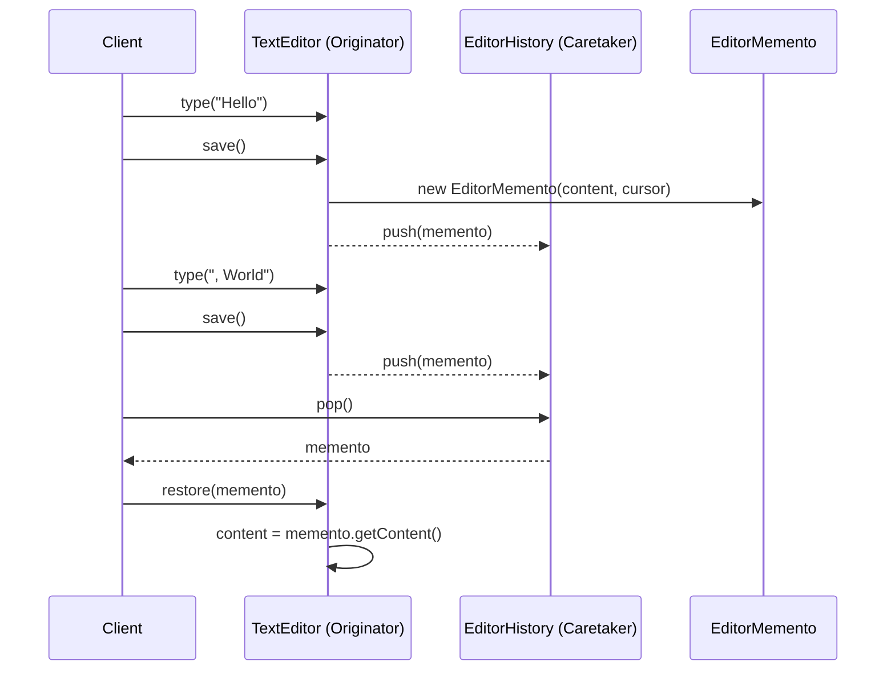
```mermaid
sequenceDiagram
    participant Client
    participant Editor as TextEditor (Originator)
    participant History as EditorHistory (Caretaker)
    participant Memento as EditorMemento

    Client->>Editor: type("Hello")
    Client->>Editor: save()
    Editor->>Memento: new EditorMemento(content, cursor)
    Editor-->>History: push(memento)

    Client->>Editor: type(", World")
    Client->>Editor: save()
    Editor-->>History: push(memento)

    Client->>History: pop()
    History-->>Client: memento
    Client->>Editor: restore(memento)
    Editor->>Editor: content = memento.getContent()
```

- `EditorHistory` (caretaker) stores `EditorMemento` objects on a `Deque` but never reads or modifies their fields — it only knows how to `push()`/`pop()`, which is what preserves `TextEditor`'s encapsulation
- Only `TextEditor` (the originator) can create (`save()`) or apply (`restore()`) a memento, since `EditorMemento`'s fields are only accessible to it

**Key implementation detail:**
```java
// Originator creates and restores from memento without exposing internals
public EditorMemento save() {
    return new EditorMemento(content, cursorPosition);
}

public void restore(EditorMemento memento) {
    this.content = memento.getContent();
    this.cursorPosition = memento.getCursorPosition();
}
```

**Demo output:**
```
After 'Hello': Editor{content='Hello', cursor=5}
After ', World': Editor{content='Hello, World', cursor=12}
After '!!!': Editor{content='Hello, World!!!', cursor=15}
Undo -> Editor{content='Hello, World', cursor=12}
Undo -> Editor{content='Hello', cursor=5}
```

---

### 18. Observer

**Intent:** Define a one-to-many dependency so that when one object changes state, all its dependents are notified and updated automatically.

**Analogy:** Stock market — traders subscribe to a stock's price feed; when the price changes, all subscribed traders are notified.

**When to use:**
- Event-driven architectures
- MVC — model notifies views of changes
- Message brokers, reactive programming
- Spring `ApplicationEvent` system

**Package:** `behavioral/observer`

| File | Role |
|------|------|
| `StockObserver.java` | Observer interface |
| `StockMarket.java` | Subject — maintains subscriber list, publishes changes |
| `StockTrader.java` | Concrete observer |

**Structure:**

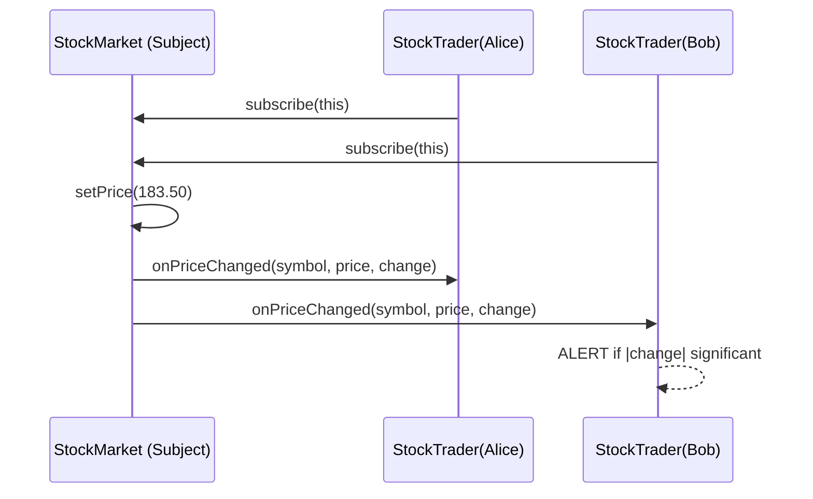
```mermaid
sequenceDiagram
    participant Market as StockMarket (Subject)
    participant Alice as StockTrader(Alice)
    participant Bob as StockTrader(Bob)

    Alice->>Market: subscribe(this)
    Bob->>Market: subscribe(this)

    Market->>Market: setPrice(183.50)
    Market->>Alice: onPriceChanged(symbol, price, change)
    Market->>Bob: onPriceChanged(symbol, price, change)
    Bob-->>Bob: ALERT if |change| significant
```

- `StockMarket` only depends on the `StockObserver` interface, never on `StockTrader` directly — new observer types can subscribe without any change to the subject
- `setPrice()` computes the delta once, then fans it out to every subscriber via `notifyObservers()`, so all observers see a consistent view of the same price change

**Key implementation detail:**
```java
public void setPrice(double newPrice) {
    double change = newPrice - price;
    this.price = newPrice;
    observers.forEach(o -> o.onPriceChanged(symbol, price, change));
}
```

**Demo output:**
```
[Alice] AAPL price: $183.50 (+3.50)
[Bob] AAPL price: $183.50 (+3.50)
  *** ALERT: significant move of 3.50!
[Alice] AAPL price: $175.00 (-8.50)
  *** ALERT: significant move of -8.50!
-- Bob unsubscribes --
[Alice] AAPL price: $190.00 (+15.00)
  *** ALERT: significant move of 15.00!
```

**Spring Boot in Practice** — `behavioral/observer/spring/SpringApplicationEventObserver.java`

- Spring's `ApplicationEvent` / `@EventListener` IS the Observer pattern
- Publishers have zero knowledge of their listeners — adding a new listener requires no change to the publisher
- Spring Cloud Bus extends this across services via Kafka/RabbitMQ

```java
// Subject — publishes events
@Service class OrderService {
    @Autowired ApplicationEventPublisher publisher;

    public void placeOrder(String orderId) {
        // ... persist order ...
        publisher.publishEvent(new OrderPlacedEvent(this, orderId, customerId));
    }
}

// Observer A — reacts asynchronously, no coupling to OrderService
@Component class EmailListener {
    @Async @EventListener
    public void onOrderPlaced(OrderPlacedEvent e) { sendEmail(e.getCustomerId()); }
}

// Observer B — another independent listener
@Component class InventoryListener {
    @EventListener
    public void onOrderPlaced(OrderPlacedEvent e) { reserveStock(e.getOrderId()); }
}

// Built-in Spring events:
@EventListener(ApplicationReadyEvent.class)
public void onReady() { /* app fully started */ }

// Spring Cloud Bus — cross-service observer over Kafka/RabbitMQ:
// publisher.publishEvent(new RefreshRemoteApplicationEvent(...))
// → sent to message broker → ALL service instances refresh their @RefreshScope beans
```

---

### 19. State

**Intent:** Allow an object to alter its behavior when its internal state changes. The object will appear to change its class.

**Analogy:** A traffic light — its behavior (what to show next) depends on its current color (state).

**When to use:**
- Object behavior depends on its state and must change at runtime
- Large conditional statements based on object state
- Order lifecycle, vending machine states, TCP connection states

**Package:** `behavioral/state`

| File | Role |
|------|------|
| `TrafficLightState.java` | State interface |
| `RedState.java`, `GreenState.java`, `YellowState.java` | Concrete states |
| `TrafficLight.java` | Context — delegates behavior to current state |

**Structure:**

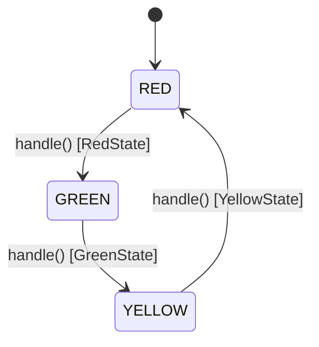
```mermaid
stateDiagram-v2
    [*] --> RED
    RED --> GREEN: handle() [RedState]
    GREEN --> YELLOW: handle() [GreenState]
    YELLOW --> RED: handle() [YellowState]
```

- `TrafficLight.change()` doesn't contain any conditional logic about colors — it simply calls `state.handle(this)` and lets the **current state object** decide both what happens now and what the next state is
- Each concrete state (`RedState`, `GreenState`, `YellowState`) calls `light.setState(new NextState())` at the end of `handle()`, so the transition table lives inside the states themselves rather than in the context

**Key implementation detail:**
```java
// Context delegates all behavior to its current state
public void change() {
    state.handle(this); // state transitions itself
}

// Each state knows its successor
public class GreenState implements TrafficLightState {
    public void handle(TrafficLight light) {
        System.out.println("GREEN: Go! Switching to YELLOW.");
        light.setState(new YellowState());
    }
}
```

**Demo output:**
```
Initial: RED
RED: Stop! Switching to GREEN.
GREEN: Go! Switching to YELLOW.
YELLOW: Caution! Switching to RED.
...
```

**Spring Boot in Practice** — `behavioral/state/spring/SpringStateMachineDemo.java`

- Spring State Machine (`spring-statemachine`) implements State pattern declaratively
- Manages order lifecycle, workflow approvals, or any multi-step process with guards and transition actions
- States and transitions are defined in configuration classes, not scattered across business logic

```java
@Configuration @EnableStateMachine
public class OrderStateMachineConfig
        extends StateMachineConfigurerAdapter<OrderState, OrderEvent> {

    @Override
    public void configure(StateMachineStateConfigurer<OrderState, OrderEvent> states) {
        states.withStates()
            .initial(OrderState.PENDING)
            .end(OrderState.DELIVERED).end(OrderState.CANCELLED)
            .states(EnumSet.allOf(OrderState.class));
    }

    @Override
    public void configure(StateMachineTransitionConfigurer<OrderState, OrderEvent> transitions) {
        transitions
            .withExternal().source(PENDING).target(PAID).event(PAY).action(sendReceipt())
            .and()
            .withExternal().source(PAID).target(PROCESSING).event(START_PROCESSING)
            .and()
            .withExternal().source(PROCESSING).target(SHIPPED).event(SHIP)
            .and()
            .withExternal().source(SHIPPED).target(DELIVERED).event(DELIVER);
    }
}

// Usage
stateMachine.sendEvent(OrderEvent.PAY);         // PENDING → PAID
stateMachine.sendEvent(OrderEvent.SHIP);        // PAID → PROCESSING → SHIPPED
```

---

### 20. Strategy

**Intent:** Define a family of algorithms, encapsulate each one, and make them interchangeable. Lets the algorithm vary independently from the clients that use it.

**Analogy:** Choosing a sorting algorithm at runtime — `BubbleSort` for small arrays, `QuickSort` for general use, `MergeSort` for stable sorts.

**When to use:**
- Multiple variants of an algorithm
- Replacing conditionals that select behavior
- Payment processing strategies, compression algorithms, validation rules

**Package:** `behavioral/strategy`

| File | Role |
|------|------|
| `SortStrategy.java` | Strategy interface |
| `BubbleSortStrategy.java` | Concrete strategy |
| `QuickSortStrategy.java` | Concrete strategy |
| `MergeSortStrategy.java` | Concrete strategy |
| `Sorter.java` | Context — uses a `SortStrategy` |

**Structure:**

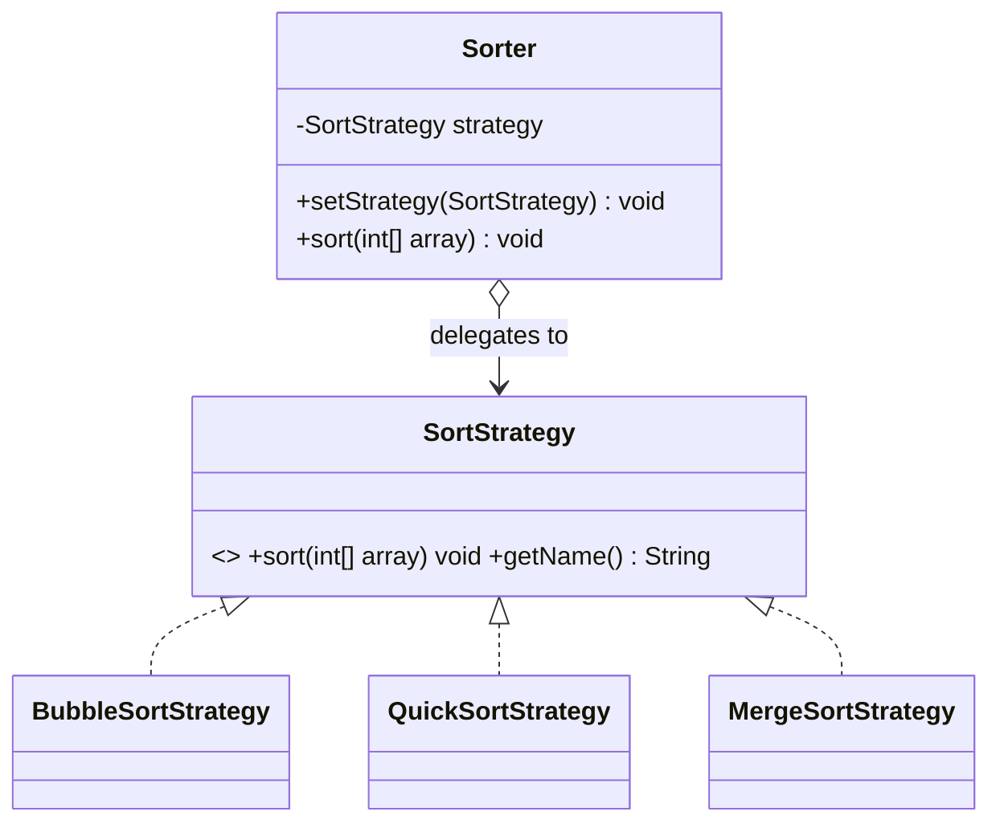
```mermaid
classDiagram
    class SortStrategy { <<interface>> +sort(int[] array) void +getName() String }
    class BubbleSortStrategy
    class QuickSortStrategy
    class MergeSortStrategy
    class Sorter {
        -SortStrategy strategy
        +setStrategy(SortStrategy) void
        +sort(int[] array) void
    }
    SortStrategy <|.. BubbleSortStrategy
    SortStrategy <|.. QuickSortStrategy
    SortStrategy <|.. MergeSortStrategy
    Sorter o--> SortStrategy : delegates to
```

- `Sorter` (the context) holds a `SortStrategy` reference and delegates `sort()` to it — swapping algorithms at runtime is a single `setStrategy()` call, with zero changes to `Sorter` itself
- Each concrete strategy (`BubbleSortStrategy`, `QuickSortStrategy`, `MergeSortStrategy`) is fully interchangeable because they all satisfy the same `sort(int[])` contract, regardless of internal algorithmic complexity

**Key implementation detail:**
```java
// Strategy can be swapped at runtime
Sorter sorter = new Sorter(new BubbleSortStrategy());
sorter.sort(data);

sorter.setStrategy(new QuickSortStrategy());
sorter.sort(data);
```

**Demo output:**
```
Using: BubbleSort
BubbleSort result: [1, 2, 3, 5, 8, 9]
Using: QuickSort
QuickSort result: [1, 2, 3, 5, 8, 9]
Using: MergeSort
MergeSort result: [1, 2, 3, 5, 8, 9]
```

**Spring Boot in Practice** — `behavioral/strategy/spring/SpringConditionalStrategy.java`

- Spring uses Strategy in two ways: selecting an implementation at startup via `@Conditional`, or injecting ALL implementations as `List<T>` and selecting at runtime by type
- The runtime selection approach (inject all, pick by key) is the most flexible and common in enterprise Spring code

```java
// Runtime strategy selection — inject all implementations, pick by key
@Service
class PaymentService {
    private final Map<String, PaymentStrategy> strategies;

    // Spring injects ALL PaymentStrategy beans automatically
    public PaymentService(List<PaymentStrategy> list) {
        this.strategies = list.stream()
            .collect(Collectors.toMap(PaymentStrategy::getType, s -> s));
    }

    public String pay(String type, double amount) {
        return strategies.get(type).pay(amount);  // select strategy at runtime
    }
}

// Startup-time strategy selection via @ConditionalOnProperty:
@Bean @ConditionalOnProperty(name = "cache.strategy", havingValue = "redis")
public CacheManager redisCacheManager(RedisConnectionFactory cf) { ... }

@Bean @ConditionalOnProperty(name = "cache.strategy", havingValue = "caffeine", matchIfMissing = true)
public CacheManager caffeineCacheManager() { ... }

// Spring Security auth strategies — tried in order, first success wins:
http.authenticationProvider(jwtProvider)
    .authenticationProvider(ldapProvider)
    .authenticationProvider(daoProvider);
```

---

### 21. Template Method

**Intent:** Define the **skeleton of an algorithm** in a base class, deferring some steps to subclasses. Subclasses redefine certain steps without changing the algorithm's structure.

**Analogy:** A data mining pipeline — extract, parse, analyze, report. The structure is always the same; what changes per format (CSV vs PDF) are the `extractData` and `parseData` steps.

**When to use:**
- Multiple classes share the same algorithm structure but differ in certain steps
- Preventing code duplication in related classes
- Frameworks that define invariant parts and let users hook into specific steps

**Package:** `behavioral/templatemethod`

| File | Role |
|------|------|
| `DataMiner.java` | Abstract class with `mine()` template method |
| `CsvDataMiner.java` | Overrides `extractData` and `parseData` for CSV |
| `PdfDataMiner.java` | Overrides `extractData`, `parseData`, and `sendReport` for PDF |

**Structure:**

```mermaid
classDiagram
    class DataMiner {
        <<abstract>>
        +mine(String path) void
        #extractData(String path) String*
        #parseData(String rawData) String*
        #analyzeData(String data) String
        #sendReport(String analysis) void
    }
    class CsvDataMiner {
        #extractData(String path) String
        #parseData(String rawData) String
    }
    class PdfDataMiner {
        #extractData(String path) String
        #parseData(String rawData) String
        #sendReport(String analysis) void
    }
    DataMiner <|-- CsvDataMiner
    DataMiner <|-- PdfDataMiner
    note for DataMiner "mine() is final -\nalgorithm skeleton\ncannot be altered"
```

- `mine()` is declared `final` — subclasses are structurally prevented from changing the sequence of steps (extract → parse → analyze → report), only the individual step implementations
- `analyzeData()` and `sendReport()` have sensible defaults in the base class ("hook" steps), while `extractData()`/`parseData()` are abstract ("must-override" steps) — `PdfDataMiner` shows a subclass overriding both a required step and a hook (`sendReport`, to email instead of print)

**Key implementation detail:**
```java
// Template method — final prevents subclasses from altering the algorithm structure
public final void mine(String path) {
    String rawData = extractData(path);   // abstract — must override
    String parsed  = parseData(rawData);  // abstract — must override
    String analysis = analyzeData(parsed); // has default, can override
    sendReport(analysis);                  // has default, can override
}
```

**Demo output:**
```
CSV: Reading file data.csv
CSV: Parsing comma-separated data
Report: Analysis of [parsed-csv-rows]: found 42 patterns

PDF: Extracting text from report.pdf
PDF: Parsing PDF structure
PDF Report (emailed): Analysis of [parsed-pdf-text]: found 42 patterns
```

**Spring Boot in Practice** — `behavioral/templatemethod/spring/SpringTemplateMethod.java`

- Every Spring `*Template` class defines an algorithm skeleton (connection, error handling, resource cleanup) and lets you provide only the variable step (SQL, URL, message)
- This pattern eliminates the most common source of bugs: forgetting to close connections or roll back transactions

```java
// JdbcTemplate — you provide SQL + RowMapper; Spring handles everything else
List<Order> orders = jdbcTemplate.query(
    "SELECT * FROM orders WHERE status = ?",
    (rs, rowNum) -> new Order(rs.getLong("id"), rs.getString("status")),
    "ACTIVE"
);

// TransactionTemplate — you provide the business logic lambda
transactionTemplate.execute(status -> {
    orderRepo.save(order);        // variable step
    inventoryRepo.reduce(order);  // variable step
    return order.getId();
    // Spring handles: begin, commit, rollback, connection cleanup
});

// RestTemplate — you provide URL + return type
String response = restTemplate.getForObject(
    "https://api.example.com/orders/{id}", String.class, orderId
);

// Spring Cloud OpenFeign wraps the same pattern declaratively:
@FeignClient(name = "order-service")
interface OrderClient {
    @GetMapping("/orders/{id}")
    Order findById(@PathVariable String id);  // no boilerplate needed
}
```

---

### 22. Visitor

**Intent:** Represent an operation to be performed on elements of an object structure. Visitor lets you define a new operation **without changing** the classes of the elements on which it operates.

**Analogy:** Computing area and perimeter for shapes — instead of adding `computeArea()` and `computePerimeter()` to each shape class, visitors encapsulate these operations externally.

**When to use:**
- Many distinct and unrelated operations need to be performed on an object structure
- The object structure rarely changes but you often need to add new operations
- AST traversal in compilers, tax calculation systems, document export

**Package:** `behavioral/visitor`

| File | Role |
|------|------|
| `ShapeVisitor.java` | Visitor interface |
| `VisitableShape.java` | Element interface with `accept(ShapeVisitor)` |
| `Circle.java`, `Rectangle.java`, `Triangle.java` | Concrete elements |
| `AreaCalculatorVisitor.java` | Concrete visitor |
| `PerimeterCalculatorVisitor.java` | Concrete visitor |

**Structure:**

```mermaid
classDiagram
    class ShapeVisitor { <<interface>> +visit(Circle) void +visit(Rectangle) void +visit(Triangle) void }
    class VisitableShape { <<interface>> +accept(ShapeVisitor) void }
    class Circle { +accept(ShapeVisitor v) void }
    class Rectangle { +accept(ShapeVisitor v) void }
    class Triangle { +accept(ShapeVisitor v) void }
    class AreaCalculatorVisitor
    class PerimeterCalculatorVisitor

    VisitableShape <|.. Circle
    VisitableShape <|.. Rectangle
    VisitableShape <|.. Triangle
    ShapeVisitor <|.. AreaCalculatorVisitor
    ShapeVisitor <|.. PerimeterCalculatorVisitor
    Circle ..> ShapeVisitor : accept() double-dispatches to visit(Circle)
```

- Two independent hierarchies exist side by side: shapes (`Circle`/`Rectangle`/`Triangle`) and operations (`AreaCalculatorVisitor`/`PerimeterCalculatorVisitor`) — adding a new operation (e.g. a `PerimeterCalculatorVisitor`) requires zero changes to any shape class
- **Double dispatch** is the mechanism that makes this work: `shape.accept(visitor)` calls back `visitor.visit(this)`, where `this`'s static type inside each shape class resolves to the correct overload (`visit(Circle)` vs `visit(Rectangle)`) at compile time — something a single `visit(Shape)` method couldn't do

**Key implementation detail:**
```java
// Double dispatch — shape calls back the visitor with its own type
public class Circle implements VisitableShape {
    public void accept(ShapeVisitor visitor) {
        visitor.visit(this); // dispatches to visit(Circle)
    }
}
```

**Demo output:**
```
-- Area --
Circle area (r=5.0): 78.54
Rectangle area (4.0 x 6.0): 24.00
Triangle area (base=3.0, h=4.0): 6.00
-- Perimeter --
Circle perimeter (r=5.0): 31.42
Rectangle perimeter: 20.00
Triangle perimeter: 12.00
```

---

### 23. Interpreter

**Intent:** Given a language, define a representation for its grammar and provide an interpreter that uses the representation to interpret sentences in that language.

**Analogy:** A boolean expression evaluator for access control rules — `(ADMIN OR MANAGER) AND ACTIVE`.

**When to use:**
- Simple domain-specific languages (DSLs)
- Query languages, filter expressions, rule engines
- SQL parsers, regex engines (conceptually)

**Package:** `behavioral/interpreter`

| File | Role |
|------|------|
| `Expression.java` | Abstract expression |
| `TerminalExpression.java` | Leaf — checks if context contains a token |
| `OrExpression.java` | Non-terminal — evaluates `left OR right` |
| `AndExpression.java` | Non-terminal — evaluates `left AND right` |
| `InterpreterDemo.java` | Builds and evaluates the expression tree |

**Structure:**

```mermaid
classDiagram
    class Expression { <<interface>> +interpret(String context) boolean }
    class TerminalExpression { -String data +interpret(String) boolean }
    class OrExpression { -Expression left -Expression right +interpret(String) boolean }
    class AndExpression { -Expression left -Expression right +interpret(String) boolean }

    Expression <|.. TerminalExpression
    Expression <|.. OrExpression
    Expression <|.. AndExpression
    OrExpression o--> Expression : left/right
    AndExpression o--> Expression : left/right
```

- `TerminalExpression` is the leaf of the grammar (checks whether a single token is present in the context string); `OrExpression`/`AndExpression` are non-terminals that recursively `interpret()` their `left` and `right` children and combine the booleans
- Building `canAccess = new AndExpression(new OrExpression(isAdmin, isManager), isActive)` composes a small parse tree by hand — each node's `interpret()` call recurses into its children, exactly like a compiler evaluating an AST

**Key implementation detail:**
```java
// Composing an expression tree
Expression isAdmin   = new TerminalExpression("ADMIN");
Expression isManager = new TerminalExpression("MANAGER");
Expression isActive  = new TerminalExpression("ACTIVE");

Expression hasRole   = new OrExpression(isAdmin, isManager);
Expression canAccess = new AndExpression(hasRole, isActive);

canAccess.interpret("ADMIN ACTIVE");   // true
canAccess.interpret("USER ACTIVE");    // false
canAccess.interpret("ADMIN SUSPENDED"); // false
```

**Demo output:**
```
Context: ADMIN ACTIVE          -> Access: true
Context: MANAGER ACTIVE        -> Access: true
Context: USER ACTIVE           -> Access: false
Context: ADMIN SUSPENDED       -> Access: false
```

---

## Pattern Summary Table

| # | Pattern | Category | Key Intent |
|---|---------|----------|-----------|
| 1 | Singleton | Creational | One instance globally |
| 2 | Factory Method | Creational | Delegate instantiation to factory |
| 3 | Abstract Factory | Creational | Create families of related objects |
| 4 | Builder | Creational | Step-by-step complex object construction |
| 5 | Prototype | Creational | Clone existing objects |
| 6 | Adapter | Structural | Make incompatible interfaces compatible |
| 7 | Bridge | Structural | Decouple abstraction from implementation |
| 8 | Composite | Structural | Uniform tree structures |
| 9 | Decorator | Structural | Dynamically add behavior |
| 10 | Facade | Structural | Simplify complex subsystem |
| 11 | Flyweight | Structural | Share fine-grained objects |
| 12 | Proxy | Structural | Control object access |
| 13 | Chain of Responsibility | Behavioral | Pass request along handler chain |
| 14 | Command | Behavioral | Encapsulate requests as objects |
| 15 | Iterator | Behavioral | Sequential access to collection |
| 16 | Mediator | Behavioral | Centralize object communication |
| 17 | Memento | Behavioral | Capture and restore object state |
| 18 | Observer | Behavioral | Notify dependents of state changes |
| 19 | State | Behavioral | Change behavior with state |
| 20 | Strategy | Behavioral | Swap algorithms at runtime |
| 21 | Template Method | Behavioral | Define algorithm skeleton |
| 22 | Visitor | Behavioral | Add operations without modifying classes |
| 23 | Interpreter | Behavioral | Evaluate grammar/expressions |

---

## Running the Examples

Each pattern class has a static `demo()` method. You can invoke them from `GangOfFourApplication`:

```java
// Example: run specific demos
DatabaseConnection.demo();
NotificationFactory.demo();
Pizza.demo();
// etc.
```

Or run the Spring Boot app:
```bash
./mvnw spring-boot:run
```

Compile and run tests:
```bash
./mvnw test
```
