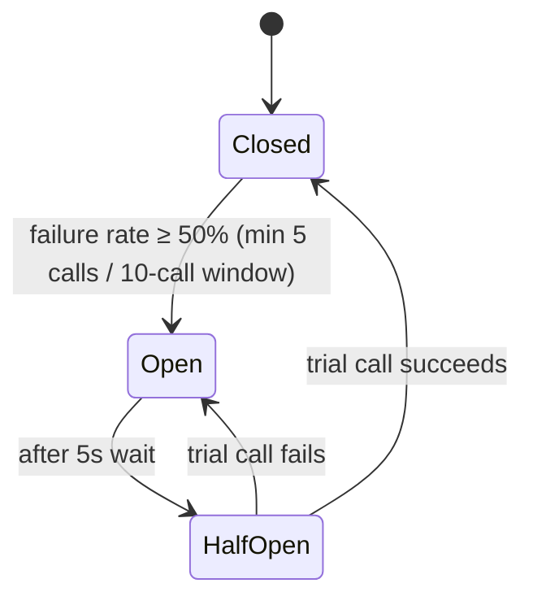
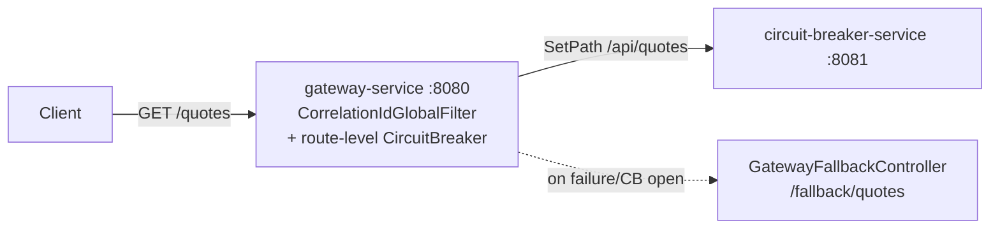
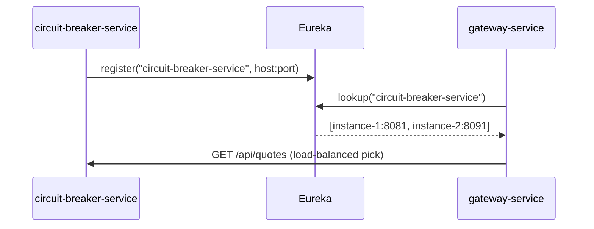
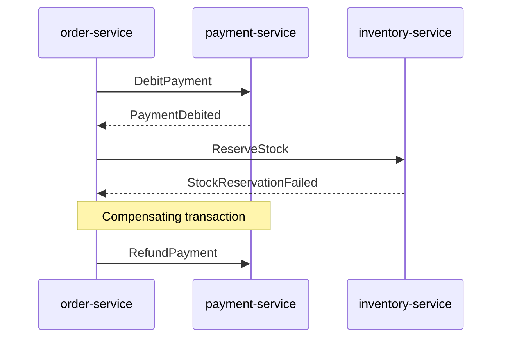

# Microservice Patterns — Java / Spring Boot

Distributed-systems patterns, each as its own runnable Spring Boot module — as opposed to
`gang-of-four-patterns`, whose patterns live inside a single process. This module is a
Maven aggregator (`packaging=pom`); each pattern below is its own child module with its
own `mvn spring-boot:run`.

| Module | Pattern | Status |
|---|---|---|
| [`circuit-breaker-service`](circuit-breaker-service/) | Circuit Breaker (Resilience4j) | **Implemented** |
| [`gateway-service`](gateway-service/) | API Gateway (Spring Cloud Gateway) | **Implemented** |
| — | Service Discovery | Roadmap |
| — | Saga | Roadmap |
| — | Externalized Configuration | Roadmap |

---

## Table of Contents

- [1. Circuit Breaker — `circuit-breaker-service`](#1-circuit-breaker--circuit-breaker-service) — *implemented*
- [2. API Gateway — `gateway-service`](#2-api-gateway--gateway-service) — *implemented*
- [3. Service Discovery](#3-service-discovery) — *roadmap*
- [4. Saga](#4-saga) — *roadmap*
- [5. Externalized Configuration](#5-externalized-configuration) — *roadmap*
- [Running both services together](#running-both-services-together)

---

## 1. Circuit Breaker — `circuit-breaker-service`

**Intent:** Prevent a failing downstream service from being called repeatedly, giving it
time to recover and giving the caller a fast, predictable failure instead of hanging on
timeouts.

**Problem it solves:** In a synchronous call chain (`A → B → C`), if `C` becomes slow or
unresponsive, threads in `B` calling `C` pile up waiting on the timeout. If enough threads
block, `B` itself runs out of capacity — a single slow dependency cascades into a full
outage. A circuit breaker wraps the call to `C`: after a failure threshold is crossed, it
"opens" and short-circuits further calls immediately (invoking a fallback instead), so
callers stop discovering the failure the slow way.



### What's actually in the code

| File | Role |
|---|---|
| `api/QuoteController.java` | `GET /api/quotes` — the protected endpoint |
| `api/ChaosController.java` | `POST /api/chaos?failRate=N` — dials how often the downstream fails, for demoing the breaker live |
| `downstream/FlakyQuoteClient.java` | Simulated downstream; throws `DownstreamUnavailableException` at the configured fail rate |
| `service/QuoteService.java` | `@CircuitBreaker(name="quoteService", fallbackMethod="fallback")` + `@Retry(name="quoteService")` wrapping the flaky call |
| `application.yaml` | Resilience4j tuning: `sliding-window-size: 10`, `minimum-number-of-calls: 5`, `failure-rate-threshold: 50`, `wait-duration-in-open-state: 5s` |

Boot 4.1 note: the standalone `spring-boot-starter-aop` wrapper artifact was dropped from
the Boot BOM. Resilience4j's `@CircuitBreaker`/`@Retry` are `@Aspect` classes that still
need `org.aspectj:aspectjweaver` on the classpath for pointcut parsing (proxy-based, not
real weaving) — the pom depends on it directly; the BOM still manages its version.

```bash
cd circuit-breaker-service
mvn spring-boot:run                                     # port 8081
curl -s localhost:8081/api/quotes                        # normal call
curl -s -X POST 'localhost:8081/api/chaos?failRate=100'   # force every call to fail
curl -s localhost:8081/api/quotes                         # -> fallback response
curl -s localhost:8081/actuator/circuitbreakers           # state: CLOSED / OPEN / HALF_OPEN
```

`QuoteServiceCircuitBreakerTest` drives both `failRate=100` scenarios directly against the
Resilience4j registry — no live HTTP needed to prove the breaker opens and the fallback
fires.

---

## 2. API Gateway — `gateway-service`

**Intent:** Give clients a single, stable entry point into a system made of many
independently deployable services, so cross-cutting concerns (routing, correlation,
resilience) live in one place instead of duplicated in every service.



### What's actually in the code

| File | Role |
|---|---|
| `application.yaml` | Route: `Path=/quotes/**` → `SetPath=/api/quotes` on `circuit-breaker-service`, wrapped in a route-level `CircuitBreaker` filter (`fallbackUri: forward:/fallback/quotes`) |
| `filter/CorrelationIdGlobalFilter.java` | `GlobalFilter` — stamps every request with `X-Correlation-Id` (propagates an incoming one, or mints a UUID), echoed on the response so client/gateway/backend logs share one id |
| `fallback/GatewayFallbackController.java` | Target of the route's `fallbackUri` — returns a friendly JSON payload instead of surfacing the raw connection error |

Uses `spring-cloud-starter-gateway-server-webflux` — the WebFlux-first rearchitected
Gateway module (as opposed to the older `spring-cloud-starter-gateway`). One gotcha worth
recording: its `RewritePath` filter's regex requires a **literal trailing slash** after
the matched prefix (`/quotes/(?<segment>.*)` does not match a bare `/quotes` with no
sub-path) — since this route only ever proxies one fixed endpoint, `SetPath=/api/quotes`
is both simpler and correct here; `RewritePath` is for routes that forward a whole
sub-path space.

```bash
# terminal 1
cd circuit-breaker-service && mvn spring-boot:run
# terminal 2
cd gateway-service && mvn spring-boot:run               # port 8080

curl -si localhost:8080/quotes                           # 200, X-Correlation-Id header on the response
curl -s -X POST 'localhost:8081/api/chaos?failRate=100'  # break the downstream directly
curl -si localhost:8080/quotes                            # still 200 — fallback JSON, gateway breaker caught it
```

`GatewayRoutingTest` drives the whole chain with a WireMock-backed upstream (no
circuit-breaker-service needed): route + path rewrite + correlation-id propagation on the
happy path, and a connection-reset fault to prove the route-level breaker's fallback fires.

---

## 3. Service Discovery

> **Status: roadmap — not yet implemented.**

**Intent:** Let services find each other's network locations dynamically at runtime,
instead of hardcoding hostnames/ports, so instances can scale up/down or move without
every caller needing reconfiguration.

**Problem it solves:** With multiple instances of a service behind a load balancer, and
instances that come and go with autoscaling, hardcoded URLs break constantly. Each
service instead **registers** with a discovery server on startup (sending heartbeats),
and callers **look up** a healthy instance by logical service name.

**Planned shape:** a `service-registry` module (`spring-cloud-starter-netflix-eureka-server`,
`@EnableEurekaServer`) plus `@EnableDiscoveryClient` on both existing services, replacing
the gateway's fixed `uri: http://localhost:8081` with a `lb://circuit-breaker-service`
load-balanced URI.



## 4. Saga

> **Status: roadmap — not yet implemented.**

**Intent:** Maintain data consistency across multiple services that each own their own
database, when a single business transaction spans more than one service — without a
distributed (two-phase-commit) transaction.

**Problem it solves:** Placing an order might require debiting payment, reserving stock,
and creating a shipment — three services, three databases. A saga runs the operation as a
sequence of local transactions, each publishing an event that triggers the next step; if a
later step fails, prior steps are undone via explicit **compensating transactions**.

**Planned shape:** either orchestration (a central `OrderSagaOrchestrator` issuing
commands) or choreography (each service reacts to the previous service's event) — the
choreography style is the Observer pattern from `gang-of-four-patterns/behavioral/observer`
distributed across a broker instead of an in-process publisher.



## 5. Externalized Configuration

> **Status: roadmap — not yet implemented.**

**Intent:** Keep configuration outside the deployed artifact, so the same build runs in
dev/staging/prod without rebuilding, and config changes don't require a redeploy.

**Planned shape:** a `spring-cloud-config-server` module plus
`spring.config.import=configserver:...` in both existing services — the same Composite
pattern already used for Spring's `Environment`/`PropertySource` hierarchy, extended so one
composed property source is fetched remotely rather than only from local files.

---

## Running both services together

```bash
cd circuit-breaker-service && mvn spring-boot:run &    # :8081
cd gateway-service && mvn spring-boot:run &              # :8080

curl -si localhost:8080/quotes
```

Or run the whole aggregator's tests in one shot from `microservice-patterns/`:

```bash
mvn test
```
