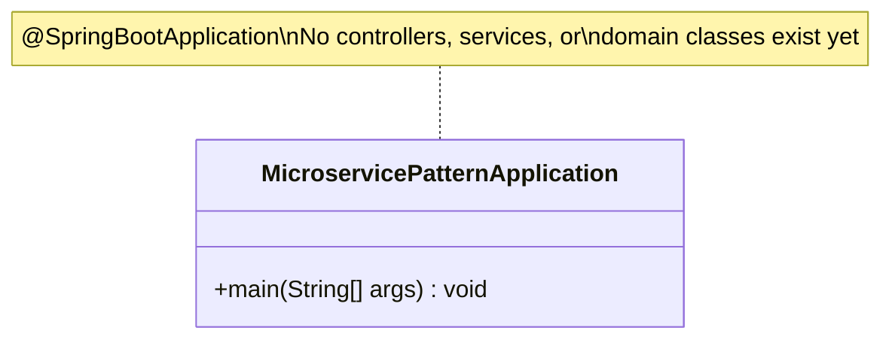
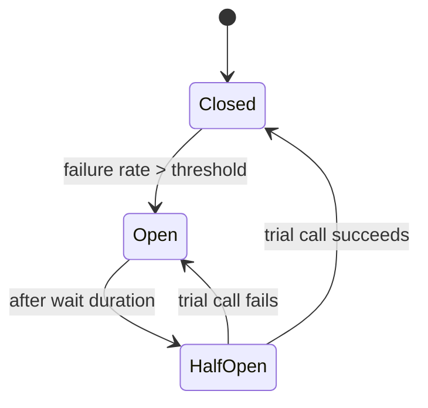
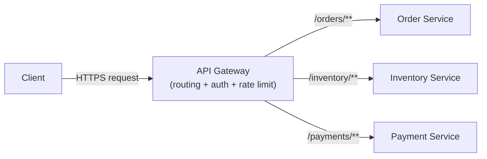
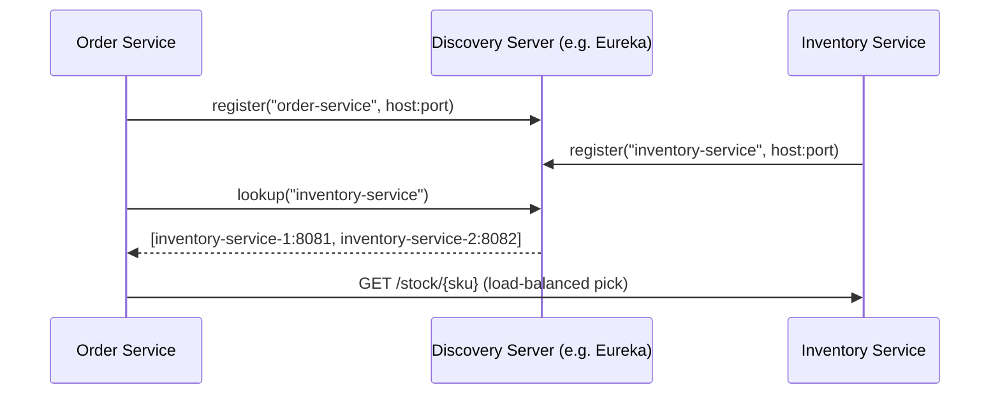
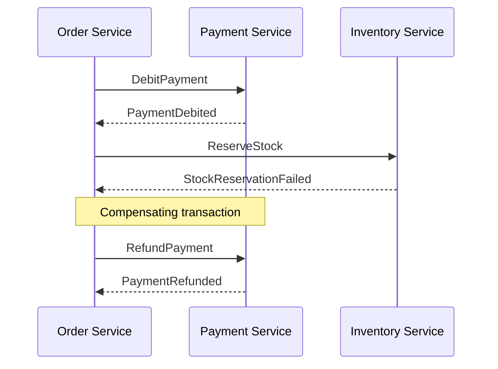

# Microservice Patterns — Java / Spring Boot

## Current Status: Scaffolding Only

This module is presently a **bare Spring Boot skeleton** — it does not yet contain any implemented microservice design pattern. This section states that plainly and precisely, rather than describing hypothetical functionality as if it existed.

**What actually exists in the source tree today:**

| File | Contents |
|------|----------|
| `src/main/java/com/org/pattern/microservicepattern/MicroservicePatternApplication.java` | A single `@SpringBootApplication` class with an empty `main()` — no controllers, no services, no domain logic |
| `src/main/resources/application.yaml` | Only `spring.application.name: microservice-pattern` — no datasource, no messaging, no resilience configuration |
| `src/main/resources/banner.txt` | ASCII startup banner — cosmetic only |
| `src/test/java/.../MicroservicePatternApplicationTests.java` | A single `contextLoads()` smoke test |
| `pom.xml` | Depends only on `spring-boot-starter` and `spring-boot-starter-test` — **no** Spring Cloud, Resilience4j, Eureka, Kafka, or any other pattern-specific dependency is declared |



**Base package:** `com.org.pattern.microservicepattern`
**Java version:** 25 | **Spring Boot:** 4.1.0

Contrast this with the sibling `gang-of-four-patterns` module, which implements all 23 classic GoF patterns with working code, package-per-pattern organization, and `demo()` methods (see [`gang-of-four-patterns/README.md`](../gang-of-four-patterns/README.md)). No equivalent implementation work has happened here yet — this document exists so that when patterns *are* added, the package layout and library choices follow a single, deliberate plan instead of being decided ad hoc per pull request.

---

## Purpose of This Document

Because there is no implemented code to document yet, the rest of this README serves a different purpose than the GoF module's README: it is a **design reference and implementation roadmap** for the microservice patterns this module is intended to eventually house, modeled on the same style of explanation (intent → problem → concrete Java/Spring shape → diagram) used in `gang-of-four-patterns`. Every pattern below is marked **NOT YET IMPLEMENTED**. When an implementation lands, its entry should be updated with the same kind of package/file table and `demo()` output the GoF README uses, and the "NOT YET IMPLEMENTED" marker should be removed.

Do not read anything below as a description of code that exists in this repository today.

---

## Table of Contents

- [Circuit Breaker](#1-circuit-breaker) — *not yet implemented*
- [API Gateway](#2-api-gateway) — *not yet implemented*
- [Service Discovery](#3-service-discovery) — *not yet implemented*
- [Saga](#4-saga) — *not yet implemented*
- [Externalized Configuration](#5-externalized-configuration) — *not yet implemented*
- [Suggested Package Layout](#suggested-package-layout)

---

## 1. Circuit Breaker

> **Status: NOT YET IMPLEMENTED.** No `CircuitBreaker`, Resilience4j dependency, or fallback method exists anywhere in this module's source tree.

**Intent:** Prevent a failing downstream service from being called repeatedly, giving it time to recover and giving the caller a fast, predictable failure instead of hanging on timeouts.

**Problem it solves:** In a synchronous call chain (`A → B → C`), if `C` becomes slow or unresponsive, threads in `B` calling `C` pile up waiting on the timeout. If enough threads block, `B` itself runs out of capacity and becomes unresponsive to `A` — a single slow dependency cascades into a full outage. A circuit breaker wraps the call to `C`: after a failure threshold is crossed, it "opens" and short-circuits further calls immediately (optionally invoking a fallback), instead of letting each caller independently discover the failure the slow way.

**How this would show up in this codebase, if implemented:** the natural home is `com.org.pattern.microservicepattern.resilience.circuitbreaker`, using `spring-boot-starter-actuator` + `resilience4j-spring-boot3` (neither is currently a dependency), with a `@CircuitBreaker(name = "...", fallbackMethod = "...")` annotated client method plus its fallback, mirroring the shape already demonstrated (as a GoF Decorator) in `gang-of-four-patterns/structural/decorator/spring/SpringResilience4jDecorator.java`.



- **Closed:** calls pass through normally; failures are counted
- **Open:** calls fail fast (or hit a fallback) without touching the downstream service at all
- **Half-Open:** a limited number of trial calls are allowed through to test whether the dependency has recovered

---

## 2. API Gateway

> **Status: NOT YET IMPLEMENTED.** No gateway module, route configuration, or `spring-cloud-gateway` dependency exists in this repository.

**Intent:** Provide clients with a single, stable entry point into a system made of many independently deployable services, so that clients don't need to know service topology, and cross-cutting concerns (auth, rate limiting, routing) live in one place instead of being duplicated in every service.

**Problem it solves:** Without a gateway, a client (mobile app, browser SPA, or another service) must know the network address of every backend service it talks to, and every service must independently implement authentication, TLS termination, rate limiting, and request logging. An API Gateway centralizes routing (`/orders/** → order-service`, `/inventory/** → inventory-service`) and cross-cutting filters, so backend services can focus purely on business logic.

**How this would show up in this codebase, if implemented:** a `spring-cloud-starter-gateway` dependency plus route predicates/filters defined either in `application.yaml` or a `RouteLocator` bean, reusing the same Chain-of-Responsibility shape already documented for Spring Security's filter chain in `gang-of-four-patterns/behavioral/chainofresponsibility/spring/SpringSecurityFilterChain.java` — a gateway's filter chain (auth → rate-limit → circuit-breaker → route) is the same GoF pattern applied at the edge of the system rather than inside a single service.



---

## 3. Service Discovery

> **Status: NOT YET IMPLEMENTED.** No Eureka client/server, Consul, or any registry dependency is present.

**Intent:** Let services find each other's network locations dynamically at runtime, instead of hardcoding hostnames/ports, so instances can scale up/down or move without every caller needing reconfiguration.

**Problem it solves:** In a system with multiple instances of `order-service` behind a load balancer, and instances that come and go with autoscaling, hardcoded URLs break constantly. Each service instead **registers** itself with a discovery server on startup (and sends heartbeats), and callers **look up** a healthy instance by logical service name rather than a fixed address.

**How this would show up in this codebase, if implemented:** a `spring-cloud-starter-netflix-eureka-client` dependency with `@EnableDiscoveryClient`, paired with a `DiscoveryClient`-aware `RestClient`/`WebClient` or `@LoadBalanced RestTemplate` for calling other services by logical name (e.g. `http://order-service/orders/{id}`) instead of a literal host:port.



---

## 4. Saga

> **Status: NOT YET IMPLEMENTED.** No orchestrator, choreography event classes, or compensating-transaction logic exists in this module.

**Intent:** Maintain data consistency across multiple services that each own their own database, when a single business transaction spans more than one service — without a distributed (two-phase-commit) transaction.

**Problem it solves:** Placing an order might require debiting a payment service, reserving stock in an inventory service, and creating a shipment in a shipping service — three separate databases, three separate services. A classic ACID transaction can't span them. A saga instead runs the operation as a sequence of local transactions, each publishing an event/message that triggers the next step; if a later step fails, previously completed steps are undone via explicit **compensating transactions** (e.g. `ReleaseStockCommand` compensates `ReserveStockCommand`).

**How this would show up in this codebase, if implemented:** either an **orchestration-based** saga (a central `OrderSagaOrchestrator` service issuing commands to each participant and reacting to their replies) or a **choreography-based** saga (each service reacts to the previous service's event and publishes its own, with no central coordinator) — the choreography style is a direct application of the Observer pattern already documented in `gang-of-four-patterns/behavioral/observer`, just distributed across service boundaries via a broker (Kafka/RabbitMQ) instead of in-process `ApplicationEventPublisher`.



---

## 5. Externalized Configuration

> **Status: NOT YET IMPLEMENTED.** `application.yaml` currently declares only `spring.application.name` — there is no Config Server, `bootstrap.yaml`, or environment-specific profile.

**Intent:** Keep configuration (connection strings, feature flags, timeouts) outside the deployed artifact, so the same build can run in dev/staging/prod without rebuilding, and config changes don't require a redeploy.

**Problem it solves:** Baking environment-specific values into `application.yaml` inside the jar means every environment needs its own build, and rotating a secret or tuning a timeout requires a full redeploy. A Config Server (or equivalent — Consul KV, Vault, Kubernetes ConfigMaps) centralizes this, and services pull their configuration at startup (and optionally refresh it live via `/actuator/refresh` or Spring Cloud Bus).

**How this would show up in this codebase, if implemented:** a `spring-cloud-config-client` dependency and a `spring.config.import=configserver:...` entry — functionally this is the same Composite pattern already documented for Spring's `Environment`/`PropertySource` hierarchy in `gang-of-four-patterns/structural/composite/spring/SpringCompositePropertySource.java`, extended so that one of the composed property sources is fetched remotely from a Config Server rather than only from local files.

---

## Suggested Package Layout

If/when patterns above are implemented, the following package structure keeps each pattern isolated and self-documenting, mirroring the per-pattern-package convention already used in `gang-of-four-patterns`:

```
com.org.pattern.microservicepattern
├── MicroservicePatternApplication.java
├── resilience/
│   └── circuitbreaker/         (Circuit Breaker)
├── gateway/                    (API Gateway — likely its own Spring Cloud Gateway module/service)
├── discovery/                  (Service Discovery client registration + lookup)
├── saga/
│   └── orderfulfillment/       (Saga — orchestration or choreography)
└── config/                     (Externalized Configuration client wiring)
```

Each subpackage should follow the same documentation convention as the GoF module: a short table of files and roles, a "Key implementation detail" code excerpt, and a diagram — updated in this README as each pattern moves from *roadmap* to *implemented*.
